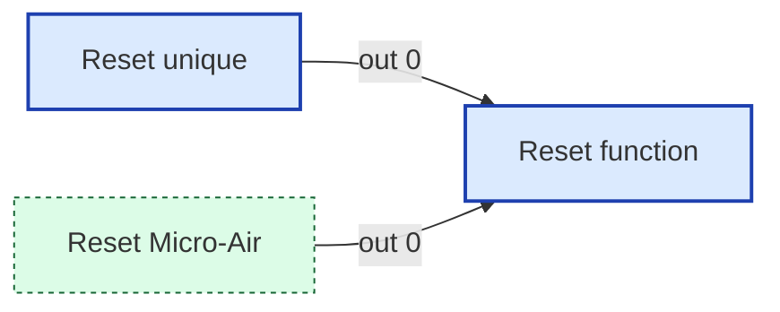
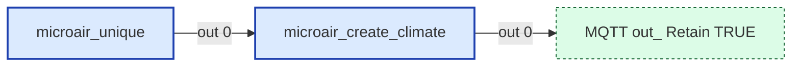
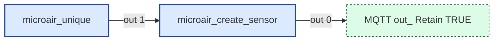
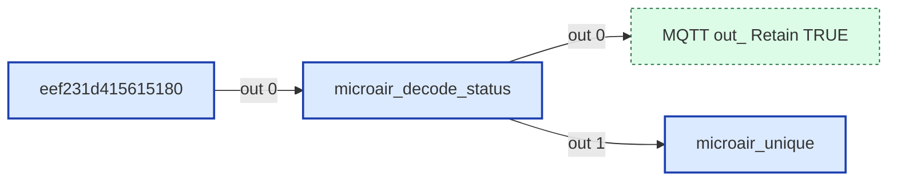
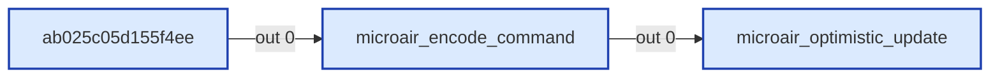
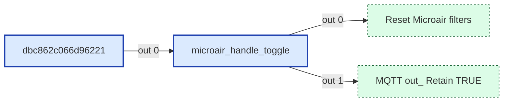
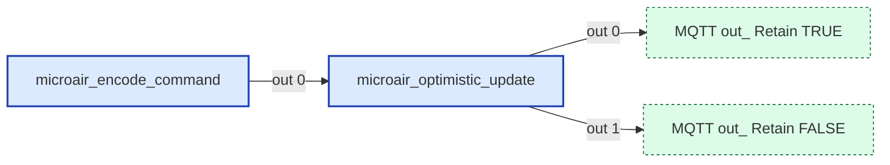
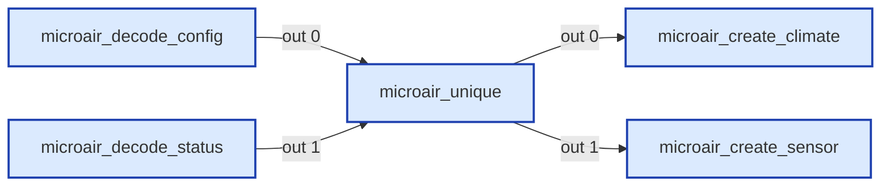

# Wiring Map: Micro-Air

> Auto-generated by `tools/wiring-map/generate.js`. Do not edit by hand.
> Source: `../micro-air.yaml`

## Tab Summary
- **Tab ID:** `e3804d2dd0b81928`
- **Disabled:** false
- **Node count:** 27
- **Function nodes:** 9
- **UI template nodes:** 0
- **Subflow instances:** 0
- **Link out (outbound):** 5
- **Link in (inbound):** 3

## Function Nodes

### Reset function
- **File:** [`Reset function.js`](./Reset function.js)
- **Node ID:** `205af5b7fa62d8ac`
- **Outputs:** 1

#### Neighborhood

#### Msg contract
_No documented msg contract._

#### Upstream
- Reset Micro-Air (link in) — this tab
- Reset unique (inject) — this tab

#### Downstream
_None._

---

### microair_create_climate
- **File:** [`microair_create_climate.js`](./microair_create_climate.js)
- **Node ID:** `c92f3be74ab20d69`
- **Outputs:** 1

#### Neighborhood

#### Msg contract
Create MicroAir Climate Entity for Home Assistant
Uses cached zone config (MAV, SPL) and observed max fan speed
for dynamic modes, fan modes, and temperature limits

#### Upstream
- microair_unique (function) — this tab, file: [`microair_unique.js`](./microair_unique.js)

#### Downstream
- **Output 0:**
  - MQTT out: Retain TRUE (link out) — this tab

---

### microair_create_sensor
- **File:** [`microair_create_sensor.js`](./microair_create_sensor.js)
- **Node ID:** `78058c1b20751a76`
- **Outputs:** 1

#### Neighborhood

#### Msg contract
Create MicroAir Outdoor Temp sensor

#### Upstream
- microair_unique (function) — this tab, file: [`microair_unique.js`](./microair_unique.js)

#### Downstream
- **Output 0:**
  - MQTT out: Retain TRUE (link out) — this tab

---

### microair_decode_config
- **File:** [`microair_decode_config.js`](./microair_decode_config.js)
- **Node ID:** `7605393317b3c471`
- **Outputs:** 1

#### Neighborhood

#### Msg contract
Decode MicroAir Zone Config
Input: MQTT message from librecoach/ble/microair/{mac}/zone/{z}/config
Caches config in persistent global context and triggers re-discovery

#### Upstream
- Micro-Air config (mqtt in) — this tab

#### Downstream
- **Output 0:**
  - microair_unique (function) — this tab, file: [`microair_unique.js`](./microair_unique.js)

---

### microair_decode_status
- **File:** [`microair_decode_status.js`](./microair_decode_status.js)
- **Node ID:** `ae5fb4f1c3213c0a`
- **Outputs:** 2

#### Neighborhood

#### Msg contract
Decode MicroAir Status
Topic: librecoach/ble/microair/{mac}/state

#### Upstream
- eef231d415615180 (rbe) — this tab

#### Downstream
- **Output 0:**
  - MQTT out: Retain TRUE (link out) — this tab
- **Output 1:**
  - microair_unique (function) — this tab, file: [`microair_unique.js`](./microair_unique.js)

---

### microair_encode_command
- **File:** [`microair_encode_command.js`](./microair_encode_command.js)
- **Node ID:** `e1cc8c52948f9b2a`
- **Outputs:** 1

#### Neighborhood

#### Msg contract
Encode MicroAir Command to MQTT
Input: HA command payload (string or number)
Topic determines command type: .../mode/set, .../temp/set, .../fan/set
Reads cached zone state from global context for mode-aware encoding

#### Upstream
- ab025c05d155f4ee (switch) — this tab

#### Downstream
- **Output 0:**
  - microair_optimistic_update (function) — this tab, file: [`microair_optimistic_update.js`](./microair_optimistic_update.js)

---

### microair_handle_toggle
- **File:** [`microair_handle_toggle.js`](./microair_handle_toggle.js)
- **Node ID:** `2f91d31ed0be26b1`
- **Outputs:** 2

#### Neighborhood

#### Msg contract
Handles enable/disable of MicroAir integration via addon config
Input: msg from librecoach/config/microair_enabled ("true" / "false")
Output 1 → Filter nodes (reset on enable)
Output 2 → MQTT Out (entity deletion on disable)

#### Upstream
- dbc862c066d96221 (delay) — this tab

#### Downstream
- **Output 0:**
  - Reset Microair filters (link out) — this tab
- **Output 1:**
  - MQTT out: Retain TRUE (link out) — this tab

---

### microair_optimistic_update
- **File:** [`microair_optimistic_update.js`](./microair_optimistic_update.js)
- **Node ID:** `e2335c226769f307`
- **Outputs:** 2

#### Neighborhood

#### Msg contract
Optimistic MicroAir State Update
Input: Encoded bridge command from microair_encode_command.js
Output 1: Optimistic HA state update (MQTT out to HA state topic)
Output 2: Original bridge command passthrough (MQTT out to bridge /set topic)

Merges pending changes into cached zone state and publishes
immediately so the HA UI updates without waiting for the next poll cycle.

#### Upstream
- microair_encode_command (function) — this tab, file: [`microair_encode_command.js`](./microair_encode_command.js)

#### Downstream
- **Output 0:**
  - MQTT out: Retain TRUE (link out) — this tab
- **Output 1:**
  - MQTT out: Retain FALSE (link out) — this tab

---

### microair_unique
- **File:** [`microair_unique.js`](./microair_unique.js)
- **Node ID:** `ba611b1fa95bf468`
- **Outputs:** 2

#### Neighborhood

#### Msg contract
Filter duplicate MicroAir status messages and route by type
Input: Standardized status object from microair_decode_status.js
       OR config update from microair_decode_config.js
Output 1: Climate (zone status — triggers create_microair_climate.js)
Output 2: Sensor (outdoor temp — triggers create_microair_sensor.js)

#### Upstream
- microair_decode_config (function) — this tab, file: [`microair_decode_config.js`](./microair_decode_config.js)
- microair_decode_status (function) — this tab, file: [`microair_decode_status.js`](./microair_decode_status.js)

#### Downstream
- **Output 0:**
  - microair_create_climate (function) — this tab, file: [`microair_create_climate.js`](./microair_create_climate.js)
- **Output 1:**
  - microair_create_sensor (function) — this tab, file: [`microair_create_sensor.js`](./microair_create_sensor.js)

---

## UI Template Nodes

_None._

## Subflow Instances

_None._

## Link Nodes

### Outbound (link out)
- **MQTT out: Retain FALSE** (`52b505b69f88888d`) →
  - MQTT out: Retain FALSE in tab `Config` ([wiring](../config/_wiring.md))
- **MQTT out: Retain TRUE** (`599ffbccfb7cd415`) →
  - MQTT out: Retain TRUE in tab `Config` ([wiring](../config/_wiring.md))
- **MQTT out: Retain TRUE** (`950e9ce654224317`) →
  - MQTT out: Retain TRUE in tab `Config` ([wiring](../config/_wiring.md))
- **MQTT out: Retain TRUE** (`b104a7e82aefcb21`) →
  - MQTT out: Retain TRUE in tab `Config` ([wiring](../config/_wiring.md))
- **Reset Microair filters** (`cdc4754f4c43430d`) →
  - Reset Microair filters in tab `Micro-Air` ([wiring](../micro-air/_wiring.md))

### Inbound (link in)
- **CONFIG_GLOBALS** (`bb154cf7301d6fa7`) ←
  - CONFIG_GLOBALS in tab `Config`
- **Reset Micro-Air** (`a58b5f05c8346eab`) ←
  - Clear unique values in tab `Config`
- **Reset Microair filters** (`1d411b577497f7ae`) ←
  - Reset Microair filters in tab `Micro-Air`

## Catch / Status Nodes

_None._

## Other Nodes

- 514aeab5c0897a23 (note) — id `514aeab5c0897a23`, in: 0, out: 0
- HA climate (mqtt in) — id `f937b8d3f3e0c24e`, in: 0, out: 1
- Micro-Air config (mqtt in) — id `feeabea8484a11e6`, in: 0, out: 1
- Micro-Air status (mqtt in) — id `d5cb654b4dad986f`, in: 0, out: 1
- Micro-Air status (group) — id `fe7cf55a75689b88`, in: 0, out: 0
- Reset unique (inject) — id `36941b7928b35ae1`, in: 0, out: 1
- Rest unique list (group) — id `cd4c55cd4f675905`, in: 0, out: 0
- ab025c05d155f4ee (switch) — id `ab025c05d155f4ee`, in: 1, out: 1
- dbc862c066d96221 (delay) — id `dbc862c066d96221`, in: 1, out: 1
- eef231d415615180 (rbe) — id `eef231d415615180`, in: 2, out: 1
