# Wiring Map: Victron

> Auto-generated by `tools/wiring-map/generate.js`. Do not edit by hand.
> Source: `../victron.yaml`

## Tab Summary
- **Tab ID:** `1fde0c4ffb03727e`
- **Disabled:** false
- **Node count:** 42
- **Function nodes:** 13
- **UI template nodes:** 0
- **Subflow instances:** 0
- **Link out (outbound):** 4
- **Link in (inbound):** 4

## Function Nodes

### Reset function
- **File:** [`Reset function.js`](./Reset function.js)
- **Node ID:** `9401b2d19494b1c2`
- **Outputs:** 1

#### Neighborhood
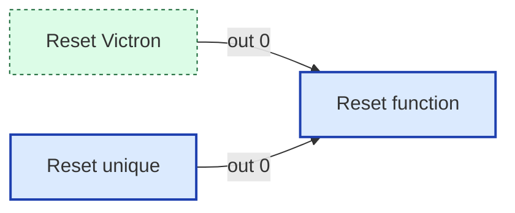

#### Msg contract
_No documented msg contract._

#### Upstream
- Reset Victron (link in) — this tab
- Reset unique (inject) — this tab

#### Downstream
_None._

---

### flush
- **File:** [`flush.js`](./flush.js)
- **Node ID:** `19993b80c1009e61`
- **Outputs:** 1

#### Neighborhood
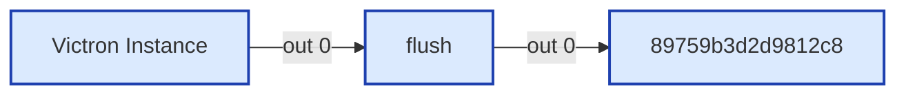

#### Msg contract
_No documented msg contract._

#### Upstream
- Victron Instance (mqtt in) — this tab

#### Downstream
- **Output 0:**
  - 89759b3d2d9812c8 (delay) — this tab

---

### victron_create
- **File:** [`victron_create.js`](./victron_create.js)
- **Node ID:** `d1a2b3c4e5f67805`
- **Outputs:** 1

#### Neighborhood
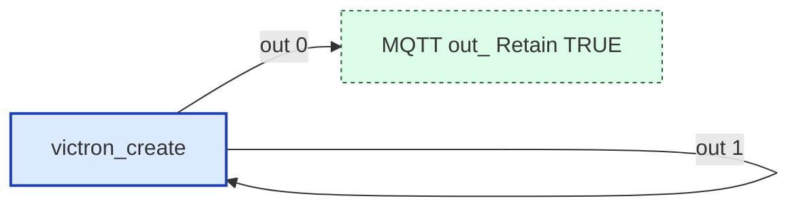

#### Msg contract
Creates Sensor entity for Victron via MQTT Discovery

#### Upstream
- victron_unique (function) — this tab, file: [`victron_unique.js`](./victron_unique.js)

#### Downstream
- **Output 0:**
  - MQTT out: Retain TRUE (link out) — this tab

---

### victron_decode_mqtt
- **File:** [`victron_decode_mqtt.js`](./victron_decode_mqtt.js)
- **Node ID:** `d1a2b3c4e5f67801`
- **Outputs:** 1

#### Neighborhood
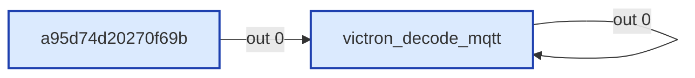

#### Msg contract
Decode Victron MQTT topic and payload into standardized message

#### Upstream
- a95d74d20270f69b (rbe) — this tab

#### Downstream
- **Output 0:**
  - victron_status (function) — this tab, file: [`victron_status.js`](./victron_status.js)
  - victron_unique (function) — this tab, file: [`victron_unique.js`](./victron_unique.js)

---

### victron_encode_command
- **File:** [`victron_encode_command.js`](./victron_encode_command.js)
- **Node ID:** `eced66f05a1796cd`
- **Outputs:** 2

#### Neighborhood
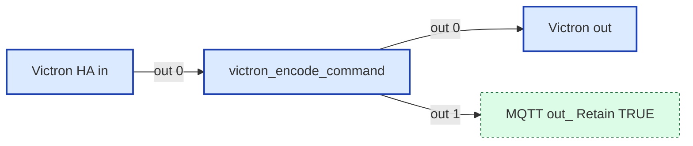

#### Msg contract
Encodes HA commands to Victron MQTT format

#### Upstream
- Victron HA in (mqtt in) — this tab

#### Downstream
- **Output 0:**
  - Victron out (mqtt out) — this tab
- **Output 1:**
  - MQTT out: Retain TRUE (link out) — this tab

---

### victron_handle_toggle
- **File:** [`victron_handle_toggle.js`](./victron_handle_toggle.js)
- **Node ID:** `48292ec85eb70ee5`
- **Outputs:** 2

#### Neighborhood
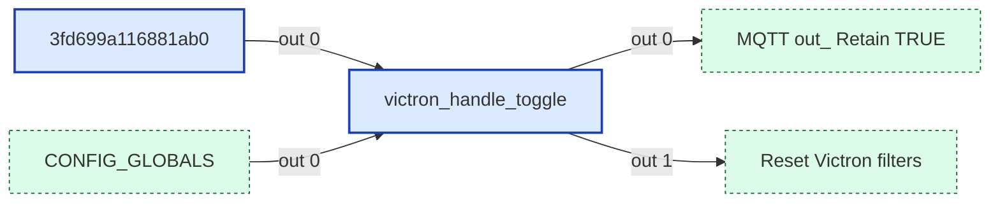

#### Msg contract
Handles enable/disable of Victron integration via addon config
Input: msg from librecoach/config/victron_enabled ("true" / "false")
Output 1 → MQTT Out (entity deletion on disable)
Output 2 → Filter nodes (reset on enable)

#### Upstream
- 3fd699a116881ab0 (delay) — this tab
- CONFIG_GLOBALS (link in) — this tab

#### Downstream
- **Output 0:**
  - MQTT out: Retain TRUE (link out) — this tab
- **Output 1:**
  - Reset Victron filters (link out) — this tab

---

### victron_keep_alive
- **File:** [`victron_keep_alive.js`](./victron_keep_alive.js)
- **Node ID:** `36f5f1a727dfd1ca`
- **Outputs:** 1

#### Neighborhood

#### Msg contract
_No documented msg contract._

#### Upstream
- Repeat (inject) — this tab

#### Downstream
- **Output 0:**
  - Victron out (mqtt out) — this tab

---

### victron_poll_devices
- **File:** [`victron_poll_devices.js`](./victron_poll_devices.js)
- **Node ID:** `ea38d37ac8c3ab57`
- **Outputs:** 1

#### Neighborhood
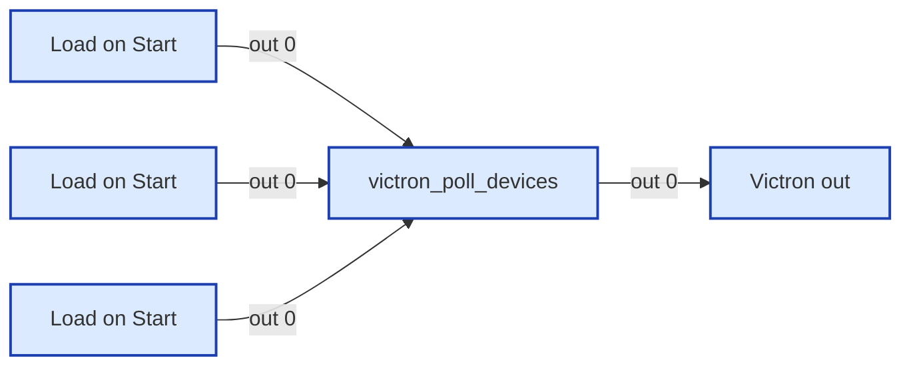

#### Msg contract
_No documented msg contract._

#### Upstream
- Load on Start (inject) — this tab
- Load on Start (inject) — this tab
- Load on Start (inject) — this tab

#### Downstream
- **Output 0:**
  - Victron out (mqtt out) — this tab

---

### victron_status
- **File:** [`victron_status.js`](./victron_status.js)
- **Node ID:** `d1a2b3c4e5f67806`
- **Outputs:** 1

#### Neighborhood
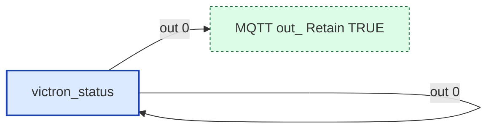

#### Msg contract
HA Status Updater for Victron

#### Upstream
- victron_decode_mqtt (function) — this tab, file: [`victron_decode_mqtt.js`](./victron_decode_mqtt.js)

#### Downstream
- **Output 0:**
  - MQTT out: Retain TRUE (link out) — this tab

---

### victron_store_devices
- **File:** [`victron_store_devices.js`](./victron_store_devices.js)
- **Node ID:** `1284b5e380db32be`
- **Outputs:** 0

#### Neighborhood
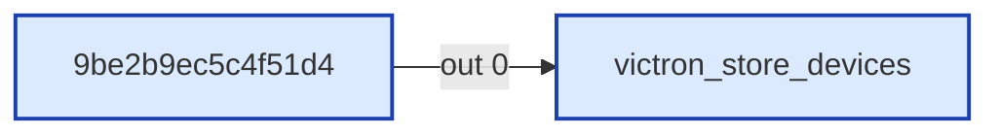

#### Msg contract
_No documented msg contract._

#### Upstream
- 9be2b9ec5c4f51d4 (rbe) — this tab

#### Downstream
_None._

---

### victron_store_instance
- **File:** [`victron_store_instance.js`](./victron_store_instance.js)
- **Node ID:** `e1032a6a79ae3e4c`
- **Outputs:** 0

#### Neighborhood
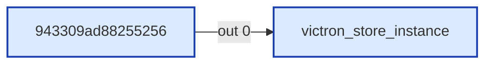

#### Msg contract
_No documented msg contract._

#### Upstream
- 943309ad88255256 (rbe) — this tab

#### Downstream
_None._

---

### victron_store_map
- **File:** [`victron_store_map.js`](./victron_store_map.js)
- **Node ID:** `d1a2b3c4e5f6780c`
- **Outputs:** 0

#### Neighborhood
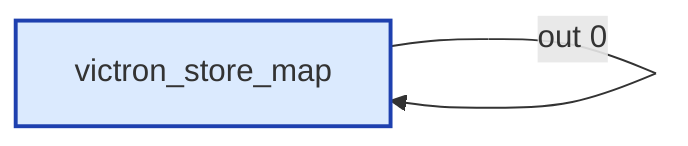

#### Msg contract
Parse Victron attributes CSV and store as nested Map in global context

#### Upstream
- Read Victron CSV (file in) — this tab

#### Downstream
_None._

---

### victron_unique
- **File:** [`victron_unique.js`](./victron_unique.js)
- **Node ID:** `d1a2b3c4e5f67804`
- **Outputs:** 2

#### Neighborhood
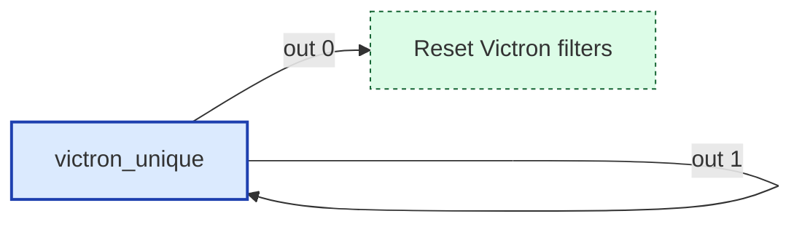

#### Msg contract
Unique Filter for Victron entities

#### Upstream
- victron_decode_mqtt (function) — this tab, file: [`victron_decode_mqtt.js`](./victron_decode_mqtt.js)

#### Downstream
- **Output 0:**
  - Reset Victron filters (link out) — this tab
- **Output 1:**
  - victron_create (function) — this tab, file: [`victron_create.js`](./victron_create.js)

---

## UI Template Nodes

_None._

## Subflow Instances

_None._

## Link Nodes

### Outbound (link out)
- **MQTT out: Retain TRUE** (`bd38c37850a3e832`) →
  - MQTT out: Retain TRUE in tab `Config` ([wiring](../config/_wiring.md))
- **MQTT out: Retain TRUE** (`e371075d4dbfc113`) →
  - MQTT out: Retain TRUE in tab `Config` ([wiring](../config/_wiring.md))
- **MQTT out: Retain TRUE** (`f3f99ba42088c9b1`) →
  - MQTT out: Retain TRUE in tab `Config` ([wiring](../config/_wiring.md))
- **Reset Victron filters** (`71ac45fb64bf70c9`) →
  - Reset Victron filters in tab `Victron` ([wiring](../victron/_wiring.md))
  - Reset Victron filters in tab `Victron` ([wiring](../victron/_wiring.md))

### Inbound (link in)
- **CONFIG_GLOBALS** (`8fdd1d506d28b9b6`) ←
  - CONFIG_GLOBALS in tab `Config`
- **Reset Victron** (`2343c8c12f2081fa`) ←
  - Clear unique values in tab `Config`
- **Reset Victron filters** (`b1b68ff387e01a3a`) ←
  - Reset Victron filters in tab `Victron`
- **Reset Victron filters** (`db3ce2f66f852ca6`) ←
  - Reset Victron filters in tab `Victron`

## Catch / Status Nodes

_None._

## Other Nodes

- 3fd699a116881ab0 (delay) — id `3fd699a116881ab0`, in: 1, out: 1
- 89759b3d2d9812c8 (delay) — id `89759b3d2d9812c8`, in: 2, out: 1
- 943309ad88255256 (rbe) — id `943309ad88255256`, in: 1, out: 1
- 990c3568d504c86e (note) — id `990c3568d504c86e`, in: 0, out: 0
- 9be2b9ec5c4f51d4 (rbe) — id `9be2b9ec5c4f51d4`, in: 2, out: 1
- Load on Start (inject) — id `0b2b4c52d68092cc`, in: 0, out: 1
- Load on Start (inject) — id `1a548b4f42a93938`, in: 0, out: 1
- Load on Start (inject) — id `6ba061be2ab168c5`, in: 0, out: 1
- Load on Start (inject) — id `70c7d357a6f48e4a`, in: 0, out: 1
- On start (inject) — id `68214a83740efc26`, in: 0, out: 1
- Read Victron CSV (file in) — id `d1a2b3c4e5f6780b`, in: 1, out: 1
- Repeat (inject) — id `f9d1a59e25ce32dd`, in: 0, out: 1
- Reset unique (inject) — id `ce787dfcc75988be`, in: 0, out: 1
- Rest unique list (group) — id `3ffa68cfd2195db1`, in: 0, out: 0
- Victron GX device configuration (group) — id `8aac091f0fffbf22`, in: 0, out: 0
- Victron HA in (mqtt in) — id `0b4d0850eae8a0b4`, in: 0, out: 1
- Victron Instance (mqtt in) — id `3057b4acf81dc8db`, in: 0, out: 2
- Victron MQTT (mqtt in) — id `903a7fac6108ac58`, in: 0, out: 1
- Victron ProductName (mqtt in) — id `2ff7b2c41ee41253`, in: 0, out: 1
- Victron out (mqtt out) — id `c80ea298a37232a2`, in: 3, out: 0
- a95d74d20270f69b (rbe) — id `a95d74d20270f69b`, in: 3, out: 1
