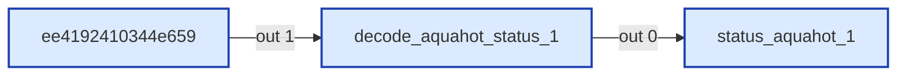
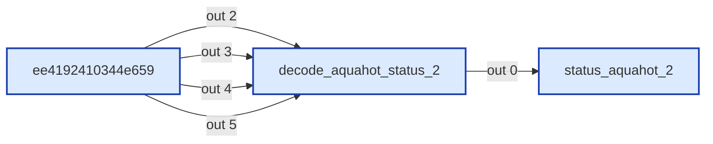
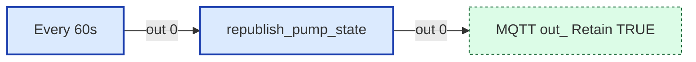
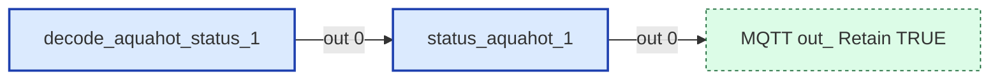
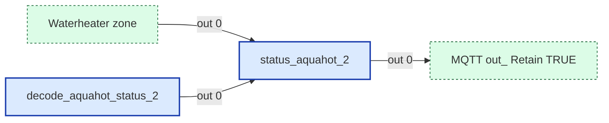

# Wiring Map: AquaHot

> Auto-generated by `tools/wiring-map/generate.js`. Do not edit by hand.
> Source: `../aquahot.yaml`

## Tab Summary
- **Tab ID:** `384249601e37ba22`
- **Disabled:** false
- **Node count:** 18
- **Function nodes:** 5
- **UI template nodes:** 0
- **Subflow instances:** 0
- **Link out (outbound):** 1
- **Link in (inbound):** 2

## Function Nodes

### decode_aquahot_status_1
- **File:** [`decode_aquahot_status_1.js`](../tabs/aquahot/decode_aquahot_status_1.js)
- **Node ID:** `5e7062bde869c7a5`
- **Outputs:** 1

#### Neighborhood

#### Msg contract
Status Updater for Aqua-Hot
Decodes proprietary AQUAHOT status byte into individual status messages

#### Upstream
- ee4192410344e659 (switch) — this tab

#### Downstream
- **Output 0:**
  - status_aquahot_1 (function) — this tab, file: [`status_aquahot_1.js`](../tabs/aquahot/status_aquahot_1.js)

---

### decode_aquahot_status_2
- **File:** [`decode_aquahot_status_2.js`](../tabs/aquahot/decode_aquahot_status_2.js)
- **Node ID:** `a6985e36ac9c8f1d`
- **Outputs:** 1

#### Neighborhood

#### Msg contract
Decoder for Proprietary AquaHot _2 DGNs:
FF01 (AQUAHOT_THERMOSTAT_STATUS_2), FF2F (AQUAHOT_COMMAND_2), FF2E (AQUAHOT_SYSTEM_STATUS_2), 6C00 (AQUAHOT_STATUS_2)

Note: These are NOT part of the standard RV-C specification. Decoding is based on
reverse-engineered analysis of recordings. Confidence levels differ per field.

#### Upstream
- ee4192410344e659 (switch) — this tab

#### Downstream
- **Output 0:**
  - status_aquahot_2 (function) — this tab, file: [`status_aquahot_2.js`](../tabs/aquahot/status_aquahot_2.js)

---

### republish_pump_state
- **Node ID:** `ff1234567890abcd`
- **Outputs:** 1

#### Neighborhood

#### Msg contract
Republishes AquaHot zone pump states from flow context every 60 seconds.
This keeps MQTT retain state fresh if Node-RED restarts after the broker.

#### Upstream
- Every 60s (inject) — this tab

#### Downstream
- **Output 0:**
  - MQTT out: Retain TRUE (link out) — this tab

---

### status_aquahot_1
- **File:** [`status_aquahot_1.js`](../tabs/aquahot/status_aquahot_1.js)
- **Node ID:** `43cd836c21f66b26`
- **Outputs:** 1

#### Neighborhood

#### Msg contract
HA Status Publisher for AquaHot (AQUAHOT_STATUS_1, EF9F)
Self-creating: publishes MQTT discovery on first valid reading per instance.
Output 1: MQTT messages (discovery + state)

#### Upstream
- decode_aquahot_status_1 (function) — this tab, file: [`decode_aquahot_status_1.js`](../tabs/aquahot/decode_aquahot_status_1.js)

#### Downstream
- **Output 0:**
  - MQTT out: Retain TRUE (link out) — this tab

---

### status_aquahot_2
- **File:** [`status_aquahot_2.js`](../tabs/aquahot/status_aquahot_2.js)
- **Node ID:** `443fd5ec55d7111b`
- **Outputs:** 1

#### Neighborhood

#### Msg contract
Publishes proprietary AquaHot zone entity states to MQTT state topics.
Also publishes MQTT discovery configs the first time a valid value is received.

ROUTING: This node handles 5 DGN names. Four are proprietary AquaHot DGNs
(FF01, FF2F, FF2E, 6C00) routed from decode_aquahot_status_2. The fifth is
WATERHEATER_STATUS_2 (1FE99) which must ALSO be routed here (in addition to
status_waterheater) so zone_active flags can update the climate entities.

#### Upstream
- Waterheater zone (link in) — this tab
- decode_aquahot_status_2 (function) — this tab, file: [`decode_aquahot_status_2.js`](../tabs/aquahot/decode_aquahot_status_2.js)

#### Downstream
- **Output 0:**
  - MQTT out: Retain TRUE (link out) — this tab

---

## UI Template Nodes

_None._

## Subflow Instances

_None._

## Link Nodes

### Outbound (link out)
- **MQTT out: Retain TRUE** (`1c1403c14b577fb4`) →
  - MQTT out: Retain TRUE in tab `Config` ([wiring](./config.md))

### Inbound (link in)
- **AQUAHOT** (`cd5a041811bc2c9a`) ←
  - AQUAHOT in tab `Config`
- **Waterheater zone** (`914be705da0531dd`) ←
  - Waterheater zone in tab `Status routing`

## Catch / Status Nodes

_None._

## Other Nodes

- 8ae5ee1969cf9219 (note) — id `8ae5ee1969cf9219`, in: 0, out: 0
- AQUAHOT_COMMAND_1 (debug) — id `c5fdb5067c820e76`, in: 2, out: 0
- AQUAHOT_STATUS_1 (debug) — id `691871e1972d2296`, in: 2, out: 0
- AQUAHOT_SYSTEM_STATUS_2 (debug) — id `1bd7e1d4c5f3864a`, in: 1, out: 0
- AQUAHOT_THERMOSTAT_STATUS_1 (debug) — id `871009c15ad9a99b`, in: 2, out: 0
- AQUAHOT_UNUSED (debug) — id `7a1eed2a34490b2a`, in: 1, out: 0
- AQUAHOT_UNUSED (debug) — id `8d93a86dc09f4c57`, in: 1, out: 0
- Aqua-Hot (group) — id `5811945b9bad79dc`, in: 0, out: 0
- Every 60s (inject) — id `ee1234567890abcd`, in: 0, out: 1
- ee4192410344e659 (switch) — id `ee4192410344e659`, in: 1, out: 14
