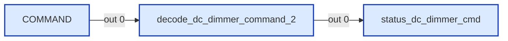
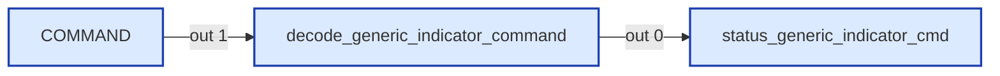
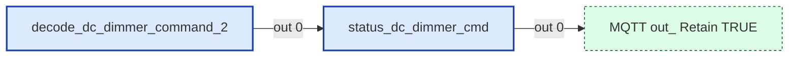
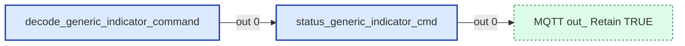
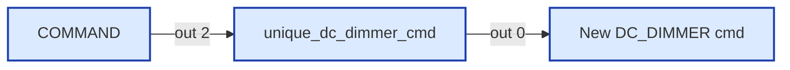

# Wiring Map: Command routing

> Auto-generated by `tools/wiring-map/generate.js`. Do not edit by hand.
> Source: `../command-routing.yaml`

## Tab Summary
- **Tab ID:** `7ecdba18640c1184`
- **Disabled:** false
- **Node count:** 18
- **Function nodes:** 8
- **UI template nodes:** 0
- **Subflow instances:** 0
- **Link out (outbound):** 1
- **Link in (inbound):** 1

## Function Nodes

### Reset function
- **File:** [`Reset function.js`](../tabs/command-routing/Reset function.js)
- **Node ID:** `4f86998be2551032`
- **Outputs:** 1

#### Neighborhood

#### Msg contract
_No documented msg contract._

#### Upstream
- Reset unique (inject) — this tab

#### Downstream
_None._

---

### Reset function
- **File:** [`Reset function(2).js`](../tabs/command-routing/Reset function(2).js)
- **Node ID:** `f96e5b3b013a2b8f`
- **Outputs:** 1

#### Neighborhood

#### Msg contract
_No documented msg contract._

#### Upstream
- Reset unique (inject) — this tab

#### Downstream
_None._

---

### decode_dc_dimmer_command_2
- **File:** [`decode_dc_dimmer_command_2.js`](../tabs/command-routing/decode_dc_dimmer_command_2.js)
- **Node ID:** `b07052c69f7b857c`
- **Outputs:** 1

#### Neighborhood

#### Msg contract
Decoder for DC_DIMMER_COMMAND_2 (DGN 1FEDBh, §6.22.4)
Input: msg.payload from decode_rvc_can (dgn, dgn_name, data_payload)
Output: decoded fields merged into payload (keeps data_payload)

#### Upstream
- COMMAND (switch) — this tab

#### Downstream
- **Output 0:**
  - status_dc_dimmer_cmd (function) — this tab, file: [`status_dc_dimmer_cmd.js`](../tabs/command-routing/status_dc_dimmer_cmd.js)

---

### decode_generic_indicator_command
- **File:** [`decode_generic_indicator_command.js`](../tabs/command-routing/decode_generic_indicator_command.js)
- **Node ID:** `e5f557604a31d3df`
- **Outputs:** 1

#### Neighborhood

#### Msg contract
Decoder for GENERIC_INDICATOR_COMMAND (DGN 1FED9h, §6.26.2)
Input: msg.payload from decode_rvc_can (dgn, dgn_name, data_payload)
Output: decoded fields merged into payload, or null for unhandled function types.
Unhandled types are logged to flow context "unknownGenericIndicatorCmd" for future analysis.

#### Upstream
- COMMAND (switch) — this tab

#### Downstream
- **Output 0:**
  - status_generic_indicator_cmd (function) — this tab, file: [`status_generic_indicator_cmd.js`](../tabs/command-routing/status_generic_indicator_cmd.js)

---

### status_dc_dimmer_cmd
- **File:** [`status_dc_dimmer_cmd.js`](../tabs/command-routing/status_dc_dimmer_cmd.js)
- **Node ID:** `905a5e9fdcc1292a`
- **Outputs:** 1

#### Neighborhood

#### Msg contract
HA Status Publisher for DC Dimmer — inferred from COMMAND_2 (DGN 1FEDBh)
Self-creating: publishes MQTT discovery on first valid command per instance.
Uses switch_N entity naming (same as STATUS_3 path).
Output 1: MQTT messages [messages] (discovery + state)

#### Upstream
- decode_dc_dimmer_command_2 (function) — this tab, file: [`decode_dc_dimmer_command_2.js`](../tabs/command-routing/decode_dc_dimmer_command_2.js)

#### Downstream
- **Output 0:**
  - MQTT out: Retain TRUE (link out) — this tab

---

### status_generic_indicator_cmd
- **File:** [`status_generic_indicator_cmd.js`](../tabs/command-routing/status_generic_indicator_cmd.js)
- **Node ID:** `e38432107a5eaea7`
- **Outputs:** 1

#### Neighborhood

#### Msg contract
Self-creating HA Status Publisher for GENERIC_INDICATOR_COMMAND (DGN 1FED9h, §6.26.2)
Eavesdrops on indicator commands to infer light state.
Entity naming: switch_i_N (instance) or switch_g_N (group).
Routing keys: "switch_i" (instance), "switch_g" (group).
Output 1: [messages] → MQTT Out

#### Upstream
- decode_generic_indicator_command (function) — this tab, file: [`decode_generic_indicator_command.js`](../tabs/command-routing/decode_generic_indicator_command.js)

#### Downstream
- **Output 0:**
  - MQTT out: Retain TRUE (link out) — this tab

---

### unique_command
- **File:** [`unique_command.js`](../tabs/command-routing/unique_command.js)
- **Node ID:** `03744ec33f2e6776`
- **Outputs:** 1

#### Neighborhood

#### Msg contract
Passes through the first message with each unique dgn_name; drops duplicates.

#### Upstream
- COMMAND (switch) — this tab

#### Downstream
- **Output 0:**
  - New COMMAND (debug) — this tab

---

### unique_dc_dimmer_cmd
- **File:** [`unique_dc_dimmer_cmd.js`](../tabs/command-routing/unique_dc_dimmer_cmd.js)
- **Node ID:** `54bee06f72b5c1f5`
- **Outputs:** 1

#### Neighborhood

#### Msg contract
Retrieve existing messages from flow context, or initialize as empty array

#### Upstream
- COMMAND (switch) — this tab

#### Downstream
- **Output 0:**
  - New DC_DIMMER cmd (debug) — this tab

---

## UI Template Nodes

_None._

## Subflow Instances

_None._

## Link Nodes

### Outbound (link out)
- **MQTT out: Retain TRUE** (`102272ba5b34f5e1`) →
  - MQTT out: Retain TRUE in tab `Config` ([wiring](./config.md))

### Inbound (link in)
- **COMMAND** (`00b1afc9a96aca8e`) ←
  - AQUAHOT in tab `Config`
  - COMMAND in tab `Config`

## Catch / Status Nodes

_None._

## Other Nodes

- 962bb2f334b27886 (note) — id `962bb2f334b27886`, in: 0, out: 0
- COMMAND (switch) — id `c063a09a82cdd204`, in: 1, out: 4
- New COMMAND (debug) — id `bc59e15bf069f17d`, in: 1, out: 0
- New DC_DIMMER cmd (debug) — id `0f09356f283bfae7`, in: 1, out: 0
- Reset unique (inject) — id `86dc00dfc2dbcd9e`, in: 0, out: 1
- Reset unique (inject) — id `b2cbbdbaab1fc227`, in: 0, out: 1
- Rest unique list (group) — id `081183d6c363e792`, in: 0, out: 0
- Rest unique list (group) — id `54c9dde7767b8935`, in: 0, out: 0
