# Wiring Map: Config

> Auto-generated by `tools/wiring-map/generate.js`. Do not edit by hand.
> Source: `../config.yaml`

## Tab Summary
- **Tab ID:** `292e70a6ba25b323`
- **Disabled:** false
- **Node count:** 91
- **Function nodes:** 26
- **UI template nodes:** 0
- **Subflow instances:** 0
- **Link out (outbound):** 15
- **Link in (inbound):** 7

## Function Nodes

### Reset function
- **File:** [`Reset function.js`](../tabs/config/Reset function.js)
- **Node ID:** `092c751dcdd12270`
- **Outputs:** 1

#### Neighborhood


#### Msg contract
_No documented msg contract._

#### Upstream
- Reset unique (inject) — this tab

#### Downstream
_None._

---

### Tally
- **File:** [`Tally.js`](../tabs/config/Tally.js)
- **Node ID:** `03a998942a940736`
- **Outputs:** 0
- **Disabled:** true

#### Neighborhood
```mermaid
flowchart LR
  classDef fn fill:#dbeafe,stroke:#1e40af,stroke-width:2px
  classDef ui fill:#ede9fe,stroke:#5b21b6,stroke-width:2px
  classDef sub fill:#fef3c7,stroke:#92400e,stroke-width:2px
  classDef link fill:#dcfce7,stroke:#166534,stroke-width:1px,stroke-dasharray:3 3
  classDef config fill:#f3f4f6,stroke:#6b7280,stroke-width:1px,stroke-dasharray:2 2
  classDef disabled opacity:0.5,stroke-dasharray:4 4
  n_03a998942a94["Tally"]:::fn:::disabled
  n_a6594a9464d8["a6594a9464d8fe4e"]:::fn
  n_a6594a9464d8 -->|out 1| n_03a998942a94
```

#### Msg contract
Tally node (temporary diagnostic)

#### Upstream
- a6594a9464d8fe4e (switch) — this tab

#### Downstream
_None._

---

### Tally report
- **File:** [`Tally report.js`](../tabs/config/Tally report.js)
- **Node ID:** `3d07bdca6b71b669`
- **Outputs:** 1
- **Disabled:** true

#### Neighborhood
```mermaid
flowchart LR
  classDef fn fill:#dbeafe,stroke:#1e40af,stroke-width:2px
  classDef ui fill:#ede9fe,stroke:#5b21b6,stroke-width:2px
  classDef sub fill:#fef3c7,stroke:#92400e,stroke-width:2px
  classDef link fill:#dcfce7,stroke:#166534,stroke-width:1px,stroke-dasharray:3 3
  classDef config fill:#f3f4f6,stroke:#6b7280,stroke-width:1px,stroke-dasharray:2 2
  classDef disabled opacity:0.5,stroke-dasharray:4 4
  n_3d07bdca6b71["Tally report"]:::fn:::disabled
  n_8037e09fbf4a["8037e09fbf4ac87b"]:::fn:::disabled
  n_8037e09fbf4a -->|out 0| n_3d07bdca6b71
```

#### Msg contract
_No documented msg contract._

#### Upstream
- 8037e09fbf4ac87b (inject) — this tab

#### Downstream
_None._

---

### address_claim_monitor
- **File:** [`address_claim_monitor.js`](../tabs/config/address_claim_monitor.js)
- **Node ID:** `4e46ba83df00a31b`
- **Outputs:** 2

#### Neighborhood
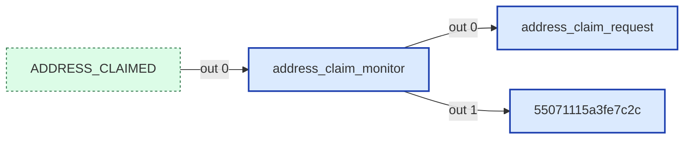

#### Msg contract
RV-C Address Claim Monitor Function
Assumes it ONLY receives decoded ADDRESS_CLAIMED messages (DGN EE00)
Compares device NAMEs to determine winner in case of conflict

#### Upstream
- ADDRESS_CLAIMED (link in) — this tab

#### Downstream
- **Output 0:**
  - address_claim_request (function) — this tab, file: [`address_claim_request.js`](../tabs/config/address_claim_request.js)
- **Output 1:**
  - 55071115a3fe7c2c (delay) — this tab

---

### address_claim_request
- **File:** [`address_claim_request.js`](../tabs/config/address_claim_request.js)
- **Node ID:** `b846bc1605dae821`
- **Outputs:** 1

#### Neighborhood
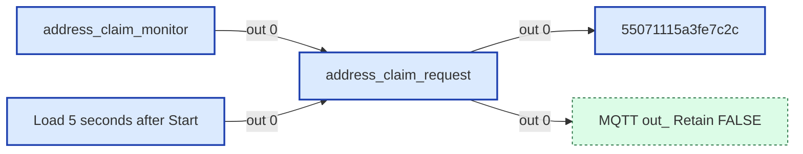

#### Msg contract
RV-C Address Claim - Send Initial Claim
Generates a persistent unique ID, selects an address, and broadcasts the
ADDRESS_CLAIMED message (DGN EE00h) to claim the address.

#### Upstream
- Load 5 seconds after Start (inject) — this tab
- address_claim_monitor (function) — this tab, file: [`address_claim_monitor.js`](../tabs/config/address_claim_monitor.js)

#### Downstream
- **Output 0:**
  - 55071115a3fe7c2c (delay) — this tab
  - MQTT out: Retain FALSE (link out) — this tab

---

### address_claim_success
- **File:** [`address_claim_success.js`](../tabs/config/address_claim_success.js)
- **Node ID:** `6423c433e099d2a5`
- **Outputs:** 1

#### Neighborhood
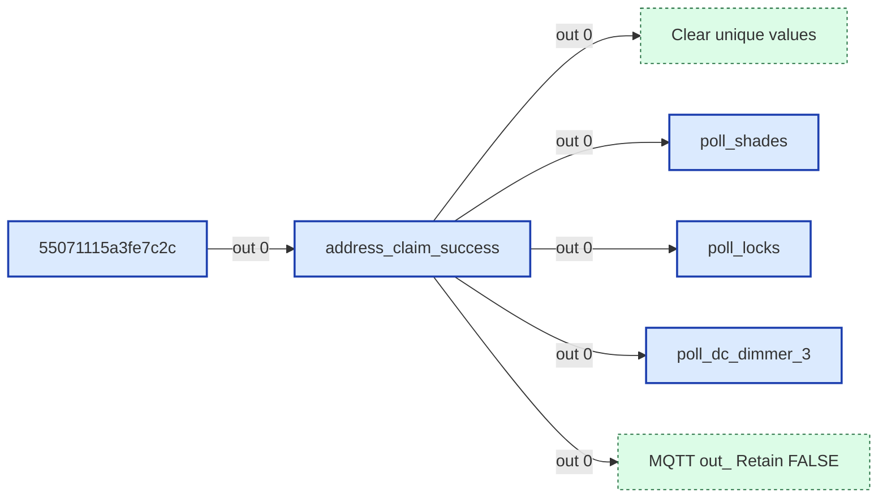

#### Msg contract
RV-C Address Claim Success Function
Called after 250ms timer expires - finalizes address claim if no conflict lost
Reference: RV-C Spec Section 3.3.2 - Source Address Claiming

IMPORTANT: This does NOT send a second ADDRESS_CLAIMED message.
We already sent ADDRESS_CLAIMED at the start of the process.
Success = 250ms timer expires without losing a conflict.

#### Upstream
- 55071115a3fe7c2c (delay) — this tab

#### Downstream
- **Output 0:**
  - Clear unique values (link out) — this tab
  - MQTT out: Retain FALSE (link out) — this tab
  - poll_dc_dimmer_3 (function) — this tab, file: [`poll_dc_dimmer_3.js`](../tabs/config/poll_dc_dimmer_3.js)
  - poll_locks (function) — this tab, file: [`poll_locks.js`](../tabs/config/poll_locks.js)
  - poll_shades (function) — this tab, file: [`poll_shades.js`](../tabs/config/poll_shades.js)

---

### beta_gate
- **File:** [`beta_gate.js`](../tabs/config/beta_gate.js)
- **Node ID:** `e2fc2c67eba80f70`
- **Outputs:** 1
- **Disabled:** true

#### Neighborhood
```mermaid
flowchart LR
  classDef fn fill:#dbeafe,stroke:#1e40af,stroke-width:2px
  classDef ui fill:#ede9fe,stroke:#5b21b6,stroke-width:2px
  classDef sub fill:#fef3c7,stroke:#92400e,stroke-width:2px
  classDef link fill:#dcfce7,stroke:#166534,stroke-width:1px,stroke-dasharray:3 3
  classDef config fill:#f3f4f6,stroke:#6b7280,stroke-width:1px,stroke-dasharray:2 2
  classDef disabled opacity:0.5,stroke-dasharray:4 4
  n_e2fc2c67eba8["beta_gate"]:::fn:::disabled
```

#### Msg contract
A simple gate node to allow messages to pass only if Beta features are enabled.

#### Upstream
_None._

#### Downstream
_None._

---

### beta_handle_toggle
- **File:** [`beta_handle_toggle.js`](../tabs/config/beta_handle_toggle.js)
- **Node ID:** `6b1a7191643fa28e`
- **Outputs:** 2

#### Neighborhood
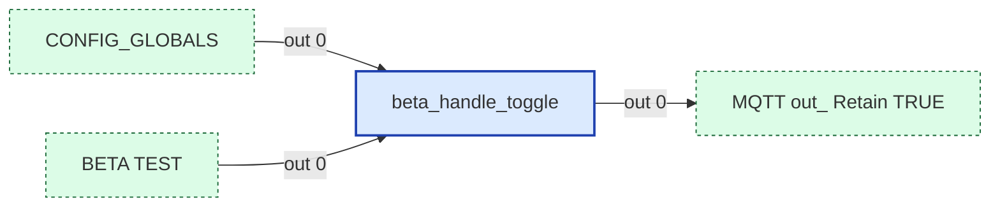

#### Msg contract
Handles enable/disable of Beta features and tracks beta entities for automatic deletion.
Input can be both config trigger and MQTT discovery configs.
Output 1 → MQTT Out (entity creation configs or entity deletion payloads)
Output 2 → Filter nodes (reset on enable)

#### Upstream
- BETA TEST (link in) — this tab
- CONFIG_GLOBALS (link in) — this tab

#### Downstream
- **Output 0:**
  - MQTT out: Retain TRUE (link out) — this tab

---

### create_user_toggles
- **File:** [`create_user_toggles.js`](../tabs/config/create_user_toggles.js)
- **Node ID:** `d6680567062a0908`
- **Outputs:** 1

#### Neighborhood
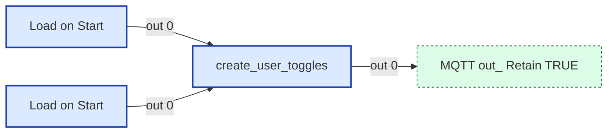

#### Msg contract
Creates LibreCoach: System config toggles via MQTT Discovery

#### Upstream
- Load on Start (inject) — this tab
- Load on Start (inject) — this tab

#### Downstream
- **Output 0:**
  - MQTT out: Retain TRUE (link out) — this tab

---

### decode_rvc_can
- **File:** [`decode_rvc_can.js`](../tabs/config/decode_rvc_can.js)
- **Node ID:** `8d7d5d3ea117cf79`
- **Outputs:** 1

#### Neighborhood
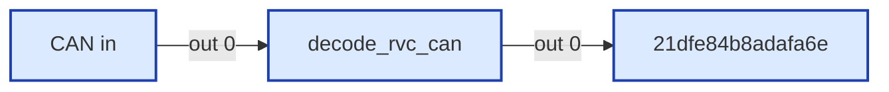

#### Msg contract
RV-C CAN Message Parser
Decodes a raw CAN message to output only the fields needed for
downstream routing (dgn_name) and decoding (data_payload).

#### Upstream
- CAN in (mqtt in) — this tab

#### Downstream
- **Output 0:**
  - 21dfe84b8adafa6e (rbe) — this tab

---

### geo_handle_toggle
- **File:** [`geo_handle_toggle.js`](../tabs/config/geo_handle_toggle.js)
- **Node ID:** `1becc1dacb0ecaf8`
- **Outputs:** 1

#### Neighborhood


#### Msg contract
Handles enable/disable of Geo integration via addon config
Input: msg from librecoach/config/geo_enabled ("true" / "false")
Output 1 → MQTT Out (entity deletion on disable)

#### Upstream
- CONFIG_GLOBALS (link in) — this tab

#### Downstream
- **Output 0:**
  - MQTT out: Retain TRUE (link out) — this tab

---

### geo_status
- **File:** [`geo_status.js`](../tabs/config/geo_status.js)
- **Node ID:** `a8a757fe3b31cf9c`
- **Outputs:** 1

#### Neighborhood
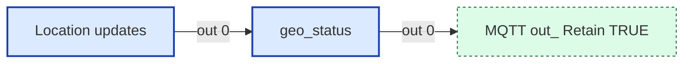

#### Msg contract
HA Status Publisher for Geo Bridge (can/status/geo)
Self-creating: publishes MQTT discovery on first valid reading.

#### Upstream
- Location updates (mqtt in) — this tab

#### Downstream
- **Output 0:**
  - MQTT out: Retain TRUE (link out) — this tab

---

### notify_user
- **File:** [`notify_user.js`](../tabs/config/notify_user.js)
- **Node ID:** `dd199275f909301f`
- **Outputs:** 1

#### Neighborhood
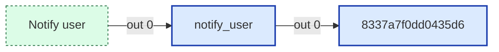

#### Msg contract
Centralized Notification Handler
Input: msg.payload with { title, message, notification_id }
Output: msg configured for HTTP Request to HA notification service

#### Upstream
- Notify user (link in) — this tab

#### Downstream
- **Output 0:**
  - 8337a7f0dd0435d6 (http request) — this tab

---

### poll_autofill
- **File:** [`poll_autofill.js`](../tabs/config/poll_autofill.js)
- **Node ID:** `ba0c52ff61838986`
- **Outputs:** 1

#### Neighborhood
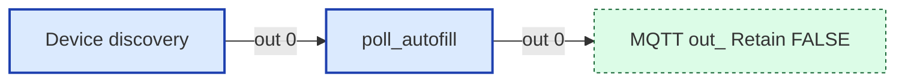

#### Msg contract
Polling Function for Autofill
Requests AUTOFILL_STATUS (1FFB1)

#### Upstream
- Device discovery (inject) — this tab

#### Downstream
- **Output 0:**
  - MQTT out: Retain FALSE (link out) — this tab

---

### poll_dc_dimmer_3
- **File:** [`poll_dc_dimmer_3.js`](../tabs/config/poll_dc_dimmer_3.js)
- **Node ID:** `73abad3deeed31e8`
- **Outputs:** 1

#### Neighborhood
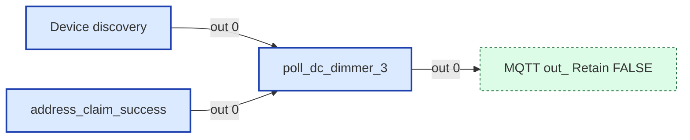

#### Msg contract
Polling Function for DC Dimmer
Requests DC_DIMMER_STATUS_3 (1FEDA)

#### Upstream
- Device discovery (inject) — this tab
- address_claim_success (function) — this tab, file: [`address_claim_success.js`](../tabs/config/address_claim_success.js)

#### Downstream
- **Output 0:**
  - MQTT out: Retain FALSE (link out) — this tab

---

### poll_dc_load
- **File:** [`poll_dc_load.js`](../tabs/config/poll_dc_load.js)
- **Node ID:** `8e350e2c0a0536b4`
- **Outputs:** 1

#### Neighborhood
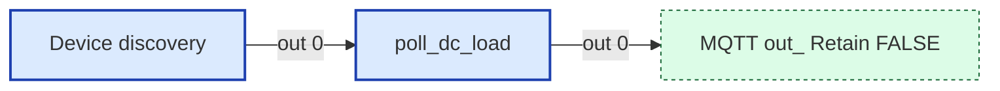

#### Msg contract
Polling Function for DC Load
Requests DC_LOAD_STATUS (1FFBD)

#### Upstream
- Device discovery (inject) — this tab

#### Downstream
- **Output 0:**
  - MQTT out: Retain FALSE (link out) — this tab

---

### poll_locks
- **File:** [`poll_locks.js`](../tabs/config/poll_locks.js)
- **Node ID:** `695ef0ed6d78a244`
- **Outputs:** 1

#### Neighborhood
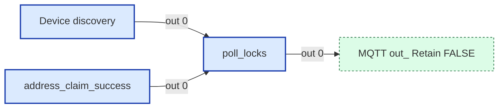

#### Msg contract
Polling Function for Locks
Requests LOCK_STATUS (1FEE5)

#### Upstream
- Device discovery (inject) — this tab
- address_claim_success (function) — this tab, file: [`address_claim_success.js`](../tabs/config/address_claim_success.js)

#### Downstream
- **Output 0:**
  - MQTT out: Retain FALSE (link out) — this tab

---

### poll_shades
- **File:** [`poll_shades.js`](../tabs/config/poll_shades.js)
- **Node ID:** `3f5eb271f702c8f3`
- **Outputs:** 1

#### Neighborhood
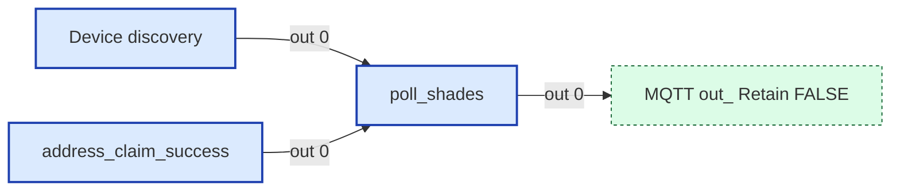

#### Msg contract
Polling Function for Shades
Requests WINDOW_SHADE_CONTROL_STATUS (1FEDE)

#### Upstream
- Device discovery (inject) — this tab
- address_claim_success (function) — this tab, file: [`address_claim_success.js`](../tabs/config/address_claim_success.js)

#### Downstream
- **Output 0:**
  - MQTT out: Retain FALSE (link out) — this tab

---

### poll_water_pump
- **File:** [`poll_water_pump.js`](../tabs/config/poll_water_pump.js)
- **Node ID:** `d3cc901dd2fbd359`
- **Outputs:** 1

#### Neighborhood
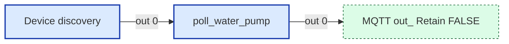

#### Msg contract
Polling Function for Water Pump
Requests WATER_PUMP_STATUS (1FFB3)

#### Upstream
- Device discovery (inject) — this tab

#### Downstream
- **Output 0:**
  - MQTT out: Retain FALSE (link out) — this tab

---

### record_unknown_capture
- **File:** [`record_unknown_capture.js`](../tabs/config/record_unknown_capture.js)
- **Node ID:** `3935564c9401e95d`
- **Outputs:** 2

#### Neighborhood
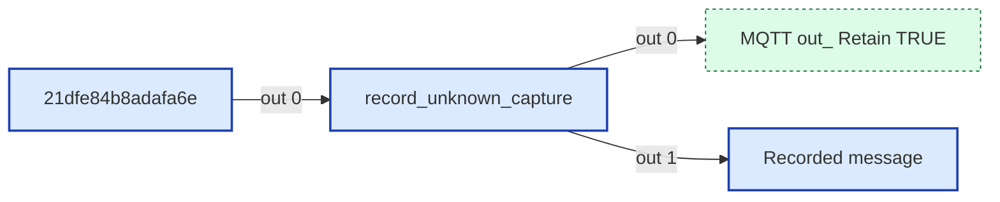

#### Msg contract
Record Unknown CAN — Terminal Capture Sink
Sits AFTER the routing switch at the end of the line.
Only receives DGNs routed to it (UNKNOWN, PROPRIETARY, COMMAND, STATUS).
Auto-stop: 2 minutes elapsed OR 1000 messages captured
Output 1: MQTT state (auto-stop off message)
Output 2: Changed messages (debug passthrough)

#### Upstream
- 21dfe84b8adafa6e (rbe) — this tab

#### Downstream
- **Output 0:**
  - MQTT out: Retain TRUE (link out) — this tab
- **Output 1:**
  - Recorded message (debug) — this tab

---

### record_unknown_export
- **File:** [`record_unknown_export.js`](../tabs/config/record_unknown_export.js)
- **Node ID:** `f3ee6dc19b0155a0`
- **Outputs:** 2

#### Neighborhood
```mermaid
flowchart LR
  classDef fn fill:#dbeafe,stroke:#1e40af,stroke-width:2px
  classDef ui fill:#ede9fe,stroke:#5b21b6,stroke-width:2px
  classDef sub fill:#fef3c7,stroke:#92400e,stroke-width:2px
  classDef link fill:#dcfce7,stroke:#166534,stroke-width:1px,stroke-dasharray:3 3
  classDef config fill:#f3f4f6,stroke:#6b7280,stroke-width:1px,stroke-dasharray:2 2
  classDef disabled opacity:0.5,stroke-dasharray:4 4
  n_4bea6d59dec3["Recording trigger"]:::fn
  n_cd73ee739dad["Notify user"]:::link
  n_cfa55144f4a1["Write file"]:::fn
  n_f3ee6dc19b01["record_unknown_export"]:::fn
  n_4bea6d59dec3 -->|out 0| n_f3ee6dc19b01
  n_f3ee6dc19b01 -->|out 0| n_cfa55144f4a1
  n_f3ee6dc19b01 -->|out 1| n_cd73ee739dad
```

#### Msg contract
Export Unknown CAN Recording
Reads recordUnknownLog from global context
Output: [[jsonMsg, htmlMsg], notifyMsg] to File Write node

#### Upstream
- Recording trigger (mqtt in) — this tab

#### Downstream
- **Output 0:**
  - Write file (file) — this tab
- **Output 1:**
  - Notify user (link out) — this tab

---

### record_unknown_toggle
- **File:** [`record_unknown_toggle.js`](../tabs/config/record_unknown_toggle.js)
- **Node ID:** `880ca1b6bf10b8d2`
- **Outputs:** 1

#### Neighborhood
```mermaid
flowchart LR
  classDef fn fill:#dbeafe,stroke:#1e40af,stroke-width:2px
  classDef ui fill:#ede9fe,stroke:#5b21b6,stroke-width:2px
  classDef sub fill:#fef3c7,stroke:#92400e,stroke-width:2px
  classDef link fill:#dcfce7,stroke:#166534,stroke-width:1px,stroke-dasharray:3 3
  classDef config fill:#f3f4f6,stroke:#6b7280,stroke-width:1px,stroke-dasharray:2 2
  classDef disabled opacity:0.5,stroke-dasharray:4 4
  n_880ca1b6bf10["record_unknown_toggle"]:::fn
  n_dca8346e061f["MQTT out_ Retain TRUE"]:::link
  n_ff7901a611c1["Recording toggle"]:::fn
  n_880ca1b6bf10 -->|out 0| n_dca8346e061f
  n_ff7901a611c1 -->|out 0| n_880ca1b6bf10
```

#### Msg contract
Record Unknown CAN — Toggle Handler
Input: MQTT payload "ON" or "OFF" from HA switch
On start: clears log, sets start time, sets recording flag
On stop: clears flag, shows message count
Output: retained state publish back to HA

#### Upstream
- Recording toggle (mqtt in) — this tab

#### Downstream
- **Output 0:**
  - MQTT out: Retain TRUE (link out) — this tab

---

### rvc_time_sync
- **File:** [`rvc_time_sync.js`](../tabs/config/rvc_time_sync.js)
- **Node ID:** `dd22c9c987534342`
- **Outputs:** 1

#### Neighborhood
```mermaid
flowchart LR
  classDef fn fill:#dbeafe,stroke:#1e40af,stroke-width:2px
  classDef ui fill:#ede9fe,stroke:#5b21b6,stroke-width:2px
  classDef sub fill:#fef3c7,stroke:#92400e,stroke-width:2px
  classDef link fill:#dcfce7,stroke:#166534,stroke-width:1px,stroke-dasharray:3 3
  classDef config fill:#f3f4f6,stroke:#6b7280,stroke-width:1px,stroke-dasharray:2 2
  classDef disabled opacity:0.5,stroke-dasharray:4 4
  n_bce5d439a67d["Every 60s"]:::fn
  n_c83c6b2b70c9["MQTT out_ Retain FALSE"]:::link
  n_dd22c9c98753["rvc_time_sync"]:::fn
  n_bce5d439a67d -->|out 0| n_dd22c9c98753
  n_dd22c9c98753 -->|out 0| n_c83c6b2b70c9
```

#### Msg contract
Broadcasts DATE_TIME_STATUS to the RV-C network (DGN 1FFFFh, §6.4)
Fires every 60s via inject node. Gated by timeSyncEnabled global (default: false).
Note: spec nominal interval is 1000 ms; 60s is adequate for clock correction without
competing with a hardware master. No source-address arbitration is implemented here.

#### Upstream
- Every 60s (inject) — this tab

#### Downstream
- **Output 0:**
  - MQTT out: Retain FALSE (link out) — this tab

---

### store_config_globals
- **File:** [`store_config_globals.js`](../tabs/config/store_config_globals.js)
- **Node ID:** `c9d298bbaa855984`
- **Outputs:** 1

#### Neighborhood
```mermaid
flowchart LR
  classDef fn fill:#dbeafe,stroke:#1e40af,stroke-width:2px
  classDef ui fill:#ede9fe,stroke:#5b21b6,stroke-width:2px
  classDef sub fill:#fef3c7,stroke:#92400e,stroke-width:2px
  classDef link fill:#dcfce7,stroke:#166534,stroke-width:1px,stroke-dasharray:3 3
  classDef config fill:#f3f4f6,stroke:#6b7280,stroke-width:1px,stroke-dasharray:2 2
  classDef disabled opacity:0.5,stroke-dasharray:4 4
  n_21029b71ed58["Config in"]:::fn
  n_88e5fa035bed["CONFIG_GLOBALS"]:::link
  n_c9d298bbaa85["store_config_globals"]:::fn
  n_21029b71ed58 -->|out 0| n_c9d298bbaa85
  n_c9d298bbaa85 -->|out 0| n_88e5fa035bed
```

#### Msg contract
_No documented msg contract._

#### Upstream
- Config in (mqtt in) — this tab

#### Downstream
- **Output 0:**
  - CONFIG_GLOBALS (link out) — this tab

---

### store_dgn_map
- **File:** [`store_dgn_map.js`](../tabs/config/store_dgn_map.js)
- **Node ID:** `cd670f6465b6374b`
- **Outputs:** 0

#### Neighborhood
```mermaid
flowchart LR
  classDef fn fill:#dbeafe,stroke:#1e40af,stroke-width:2px
  classDef ui fill:#ede9fe,stroke:#5b21b6,stroke-width:2px
  classDef sub fill:#fef3c7,stroke:#92400e,stroke-width:2px
  classDef link fill:#dcfce7,stroke:#166534,stroke-width:1px,stroke-dasharray:3 3
  classDef config fill:#f3f4f6,stroke:#6b7280,stroke-width:1px,stroke-dasharray:2 2
  classDef disabled opacity:0.5,stroke-dasharray:4 4
  n_c78420a075d4["c78420a075d43408"]:::fn
  n_cd670f6465b6["store_dgn_map"]:::fn
  n_c78420a075d4 -->|out 0| n_cd670f6465b6
```

#### Msg contract
Convert the data to a Map when initially storing it

#### Upstream
- c78420a075d43408 (json) — this tab

#### Downstream
_None._

---

### unique_unknown
- **File:** [`unique_unknown.js`](../tabs/config/unique_unknown.js)
- **Node ID:** `c781b519a9f9b156`
- **Outputs:** 1

#### Neighborhood
```mermaid
flowchart LR
  classDef fn fill:#dbeafe,stroke:#1e40af,stroke-width:2px
  classDef ui fill:#ede9fe,stroke:#5b21b6,stroke-width:2px
  classDef sub fill:#fef3c7,stroke:#92400e,stroke-width:2px
  classDef link fill:#dcfce7,stroke:#166534,stroke-width:1px,stroke-dasharray:3 3
  classDef config fill:#f3f4f6,stroke:#6b7280,stroke-width:1px,stroke-dasharray:2 2
  classDef disabled opacity:0.5,stroke-dasharray:4 4
  n_a6594a9464d8["a6594a9464d8fe4e"]:::fn
  n_c781b519a9f9["unique_unknown"]:::fn
  n_eea1641469ef["New Unknown DGN"]:::fn
  n_a6594a9464d8 -->|out 3| n_c781b519a9f9
  n_c781b519a9f9 -->|out 0| n_eea1641469ef
```

#### Msg contract
Unique Filter for Unknown Messages

#### Upstream
- a6594a9464d8fe4e (switch) — this tab

#### Downstream
- **Output 0:**
  - New Unknown DGN (debug) — this tab

---

## UI Template Nodes

_None._

## Subflow Instances

_None._

## Link Nodes

### Outbound (link out)
- **ADDRESS_CLAIMED** (`45414bacecada477`) →
  - ADDRESS_CLAIMED in tab `Config` ([wiring](./config.md))
- **AQUAHOT** (`398683928338f9c6`) →
  - COMMAND in tab `Command routing` ([wiring](./command_routing.md))
  - AQUAHOT in tab `AquaHot` ([wiring](./aquahot.md))
- **COMMAND** (`4fa9b9fdc36c83da`) →
  - COMMAND in tab `Command routing` ([wiring](./command_routing.md))
- **CONFIG_GLOBALS** (`88e5fa035bedb48c`) →
  - CONFIG_GLOBALS in tab `Config` ([wiring](./config.md))
  - CONFIG_GLOBALS in tab `Victron` ([wiring](./victron.md))
  - CONFIG_GLOBALS in tab `Config` ([wiring](./config.md))
  - CONFIG_GLOBALS in tab `Micro-Air` ([wiring](./micro-air.md))
- **Clear unique values** (`1e244bad0304bb74`) →
  - Reset Victron in tab `Victron` ([wiring](./victron.md))
  - Reset floor heat in tab `Status routing` ([wiring](./status_routing.md))
  - Reset Micro-Air in tab `Micro-Air` ([wiring](./micro-air.md))
- **HA in** (`64c5e5cfd4382453`) →
  - HA in in tab `HA Commands` ([wiring](./ha_commands.md))
- **MQTT out: Retain FALSE** (`a2334b77d3764815`) →
  - MQTT out: Retain FALSE in tab `Config` ([wiring](./config.md))
- **MQTT out: Retain FALSE** (`c83c6b2b70c927a3`) →
  - MQTT out: Retain FALSE in tab `Config` ([wiring](./config.md))
- **MQTT out: Retain TRUE** (`0a63b31d61802934`) →
  - MQTT out: Retain TRUE in tab `Config` ([wiring](./config.md))
- **MQTT out: Retain TRUE** (`5ffb64e684c20ea8`) →
  - MQTT out: Retain TRUE in tab `Config` ([wiring](./config.md))
- **MQTT out: Retain TRUE** (`6376d98589368f2b`) →
  - MQTT out: Retain TRUE in tab `Config` ([wiring](./config.md))
- **MQTT out: Retain TRUE** (`dca8346e061f1d42`) →
  - MQTT out: Retain TRUE in tab `Config` ([wiring](./config.md))
- **MQTT out: Retain TRUE** (`e38f32a1f6d36bfb`) →
  - MQTT out: Retain TRUE in tab `Config` ([wiring](./config.md))
- **Notify user** (`cd73ee739dad9f59`) →
  - Notify user in tab `Config` ([wiring](./config.md))
- **STATUS** (`02bdfc59de71b5a5`) →
  - STATUS in tab `Status routing` ([wiring](./status_routing.md))

### Inbound (link in)
- **ADDRESS_CLAIMED** (`f01db5ebc3ae2e18`) ←
  - ADDRESS_CLAIMED in tab `Config`
- **BETA TEST** (`d244b9fa7dfd5d48`) ←
- **CONFIG_GLOBALS** (`027d238476871cfe`) ←
  - CONFIG_GLOBALS in tab `Config`
- **CONFIG_GLOBALS** (`ac17a780a9a1dbcf`) ←
  - CONFIG_GLOBALS in tab `Config`
- **MQTT out: Retain FALSE** (`74329f13cbbc528a`) ←
  - MQTT out: Retain FALSE in tab `Micro-Air`
  - MQTT out: Retain FALSE in tab `HA Commands`
  - MQTT out: Retain FALSE in tab `Config`
  - MQTT out: Retain FALSE in tab `Config`
  - MQTT out: Retain FALSE in tab `HA Commands`
- **MQTT out: Retain TRUE** (`f658418a7b9b4857`) ←
  - MQTT out: Retain TRUE in tab `Config`
  - MQTT out: Retain TRUE in tab `Command routing`
  - MQTT out: Retain TRUE in tab `Templates`
  - MQTT out: Retain TRUE in tab `AquaHot`
  - MQTT out: Retain TRUE in tab `Micro-Air`
  - MQTT out: Retain TRUE in tab `Config`
  - MQTT out: Retain TRUE in tab `Config`
  - MQTT out: Retain TRUE in tab `Micro-Air`
  - MQTT out: Retain TRUE in tab `Micro-Air`
  - MQTT out: Retain TRUE in tab `Victron`
  - MQTT out: Retain TRUE in tab `Delete HA Entity`
  - MQTT out: Retain TRUE in tab `Status routing`
  - MQTT out: Retain TRUE in tab `Config`
  - MQTT out: Retain TRUE in tab `Victron`
  - MQTT out: Retain TRUE in tab `Config`
  - MQTT out: Retain TRUE in tab `Victron`
- **Notify user** (`a1e89f48333c8256`) ←
  - Notify user in tab `Templates`
  - Notify user in tab `Templates`
  - Notify user in tab `Config`
  - Notify user in tab `Templates`

## Catch / Status Nodes

_None._

## Other Nodes

- 21dfe84b8adafa6e (rbe) — id `21dfe84b8adafa6e`, in: 3, out: 2
- 55071115a3fe7c2c (delay) — id `55071115a3fe7c2c`, in: 2, out: 1
- 8037e09fbf4ac87b (inject) — id `8037e09fbf4ac87b`, in: 0, out: 1
- 8337a7f0dd0435d6 (http request) — id `8337a7f0dd0435d6`, in: 1, out: 0
- 8504190e422dfe4c (note) — id `8504190e422dfe4c`, in: 0, out: 0
- BETA Testing (group) — id `9e47041ed71c4494`, in: 0, out: 0
- CAN in (mqtt in) — id `2110ea4d0b85f784`, in: 0, out: 1
- CAN message routing (group) — id `f09f79586501cb0b`, in: 0, out: 0
- Claim CAN source address (group) — id `8ef86a1c4b59d8e1`, in: 0, out: 0
- Config in (mqtt in) — id `21029b71ed58348c`, in: 0, out: 1
- Device discovery (inject) — id `07b8bcce03f19e8f`, in: 0, out: 7
- Every 60s (inject) — id `bce5d439a67df7da`, in: 0, out: 1
- GPS Updates (group) — id `f67b4a374db41b27`, in: 0, out: 0
- HA in (mqtt in) — id `54cd7e4a8959a77c`, in: 0, out: 2
- HA in (mqtt in) — id `9e9b11b9441e51db`, in: 0, out: 2
- HA in (mqtt in) — id `b86f82e84d961549`, in: 0, out: 2
- HA in (debug) — id `d34a8c1fd2cc4320`, in: 3, out: 0
- Load 5 seconds after Start (inject) — id `515386b6b0d01893`, in: 0, out: 1
- Load RV-C Dgn Names (group) — id `9cfcca5efde78052`, in: 0, out: 0
- Load on Start (inject) — id `012b02175347902e`, in: 0, out: 1
- Load on Start (inject) — id `7e609140970f546c`, in: 0, out: 1
- Load on Start (inject) — id `c2e1bc849357fcb4`, in: 0, out: 1
- Location updates (mqtt in) — id `50dfcea54d80866b`, in: 0, out: 1
- MQTT (group) — id `3c819b7900145438`, in: 0, out: 0
- MQTT Out: Retain FALSE (mqtt out) — id `1ac6e0fa1cbb3852`, in: 1, out: 0
- MQTT Out: Retain TRUE (mqtt out) — id `cacf35b859af22a9`, in: 1, out: 0
- New Unknown DGN (debug) — id `eea1641469efb23f`, in: 1, out: 0
- Notifications (group) — id `efe52fc701f550cf`, in: 0, out: 0
- On start (inject) — id `0c76b4a89a0e60ca`, in: 0, out: 1
- RV-C Time Sync (group) — id `5169613bd2735138`, in: 0, out: 0
- Read DGN table (file in) — id `74c7e4a6cc2508eb`, in: 1, out: 1
- Recorded message (debug) — id `d79041ca83ce8b8c`, in: 1, out: 0
- Recording toggle (mqtt in) — id `ff7901a611c1e1aa`, in: 0, out: 1
- Recording trigger (mqtt in) — id `4bea6d59dec3cdde`, in: 0, out: 1
- Recording unknown DGNs (group) — id `1250cab4e8633d65`, in: 0, out: 0
- Reset (inject) — id `52f6bcc4fb0ca263`, in: 0, out: 1
- Reset unique (inject) — id `a4028527eb23fa04`, in: 0, out: 1
- Rest unique list (group) — id `9dd6a98018824be9`, in: 0, out: 0
- User input (group) — id `f81ca31c89243206`, in: 0, out: 0
- Write file (file) — id `cfa55144f4a17a5c`, in: 1, out: 0
- a6594a9464d8fe4e (switch) — id `a6594a9464d8fe4e`, in: 1, out: 6
- c78420a075d43408 (json) — id `c78420a075d43408`, in: 1, out: 1
- ceee39e4b10d6030 (group) — id `ceee39e4b10d6030`, in: 0, out: 0
