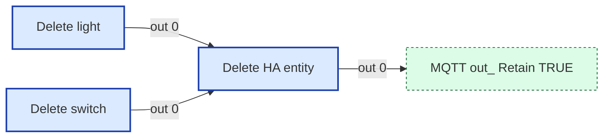

# Wiring Map: Delete HA Entity

> Auto-generated by `tools/wiring-map/generate.js`. Do not edit by hand.
> Source: `../delete-ha-entity.yaml`

## Tab Summary
- **Tab ID:** `222c995b7790b8de`
- **Disabled:** false
- **Node count:** 7
- **Function nodes:** 1
- **UI template nodes:** 0
- **Subflow instances:** 0
- **Link out (outbound):** 1
- **Link in (inbound):** 0

## Function Nodes

### Delete HA entity
- **File:** [`Delete HA entity.js`](../tabs/delete-ha-entity/Delete HA entity.js)
- **Node ID:** `a2d2ed96ff4615f9`
- **Outputs:** 1

#### Neighborhood

#### Msg contract
_No documented msg contract._

#### Upstream
- Delete light (inject) — this tab
- Delete switch (inject) — this tab

#### Downstream
- **Output 0:**
  - MQTT out: Retain TRUE (link out) — this tab

---

## UI Template Nodes

_None._

## Subflow Instances

_None._

## Link Nodes

### Outbound (link out)
- **MQTT out: Retain TRUE** (`d38c75bc1474be23`) →
  - MQTT out: Retain TRUE in tab `Config` ([wiring](./config.md))

### Inbound (link in)
_None._

## Catch / Status Nodes

_None._

## Other Nodes

- Delete Home Assistant Entity (group) — id `04e375b0c463df72`, in: 0, out: 0
- Delete light (inject) — id `8c13a65ec0410f0d`, in: 0, out: 1
- Delete switch (inject) — id `abd1e06a1927df6d`, in: 0, out: 1
- f815ee479e02a96a (note) — id `f815ee479e02a96a`, in: 0, out: 0
- inject topic (inject) — id `3a8f7d7760059de3`, in: 0, out: 1
