# Wiring Map: HA Commands

> Auto-generated by `tools/wiring-map/generate.js`. Do not edit by hand.
> Source: `../ha-commands.yaml`

## Tab Summary
- **Tab ID:** `b3d80c5dc947ec88`
- **Disabled:** false
- **Node count:** 27
- **Function nodes:** 15
- **UI template nodes:** 0
- **Subflow instances:** 0
- **Link out (outbound):** 2
- **Link in (inbound):** 1

## Function Nodes

### decode_ha_command
- **File:** [`decode_ha_command.js`](../tabs/ha-commands/decode_ha_command.js)
- **Node ID:** `a37da245aba53b96`
- **Outputs:** 1

#### Neighborhood

#### Msg contract
Parse Home Assistant MQTT command topics

#### Upstream
- HA in (link in) — this tab

#### Downstream
- **Output 0:**
  - 89946e1c7a570ed0 (switch) — this tab

---

### encode_ac_load_command
- **File:** [`encode_ac_load_command.js`](../tabs/ha-commands/encode_ac_load_command.js)
- **Node ID:** `a52b0f41097296b1`
- **Outputs:** 1

#### Neighborhood
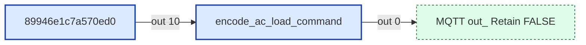

#### Msg contract
Encodes AC_LOAD_COMMAND messages (DGN 1FFBEh, §6.22.4)

#### Upstream
- 89946e1c7a570ed0 (switch) — this tab

#### Downstream
- **Output 0:**
  - MQTT out: Retain FALSE (link out) — this tab

---

### encode_aquahot_command_1
- **File:** [`encode_aquahot_command_1.js`](../tabs/ha-commands/encode_aquahot_command_1.js)
- **Node ID:** `a8882b1f35300448`
- **Outputs:** 1

#### Neighborhood
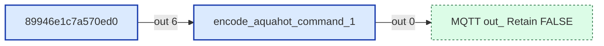

#### Msg contract
Encodes AquaHot Commands (EF64)

#### Upstream
- 89946e1c7a570ed0 (switch) — this tab

#### Downstream
- **Output 0:**
  - MQTT out: Retain FALSE (link out) — this tab

---

### encode_aquahot_command_2
- **File:** [`encode_aquahot_command_2.js`](../tabs/ha-commands/encode_aquahot_command_2.js)
- **Node ID:** `a71ac1bd86bd3e13`
- **Outputs:** 1

#### Neighborhood
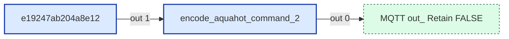

#### Msg contract
Encodes MQTT Climate commands into proprietary AquaHot zone CAN messages.
Uses FF2F (AQUAHOT_COMMAND_2) cmd_type 0x0a for interior heating priority.

#### Upstream
- e19247ab204a8e12 (switch) — this tab

#### Downstream
- **Output 0:**
  - MQTT out: Retain FALSE (link out) — this tab

---

### encode_autofill_command
- **File:** [`encode_autofill_command.js`](../tabs/ha-commands/encode_autofill_command.js)
- **Node ID:** `d367ea017bd41347`
- **Outputs:** 1

#### Neighborhood
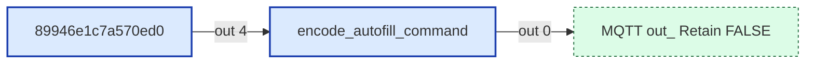

#### Msg contract
Encodes AUTOFILL_COMMAND messages (1FFB0)

#### Upstream
- 89946e1c7a570ed0 (switch) — this tab

#### Downstream
- **Output 0:**
  - MQTT out: Retain FALSE (link out) — this tab

---

### encode_dc_dimmer_command_2
- **File:** [`encode_dc_dimmer_command_2.js`](../tabs/ha-commands/encode_dc_dimmer_command_2.js)
- **Node ID:** `86a191e1f24d802a`
- **Outputs:** 1

#### Neighborhood
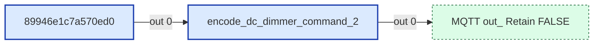

#### Msg contract
Encodes DC_DIMMER_COMMAND_2 messages (1FEDB)

#### Upstream
- 89946e1c7a570ed0 (switch) — this tab

#### Downstream
- **Output 0:**
  - MQTT out: Retain FALSE (link out) — this tab

---

### encode_dc_load_command
- **File:** [`encode_dc_load_command.js`](../tabs/ha-commands/encode_dc_load_command.js)
- **Node ID:** `e25c9c82905dc476`
- **Outputs:** 1

#### Neighborhood
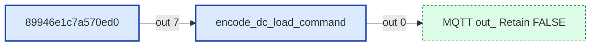

#### Msg contract
Encodes DC_LOAD_COMMAND messages (DGN 1FFBCh, §6.23.4)

#### Upstream
- 89946e1c7a570ed0 (switch) — this tab

#### Downstream
- **Output 0:**
  - MQTT out: Retain FALSE (link out) — this tab

---

### encode_floor_heat_command
- **File:** [`encode_floor_heat_command.js`](../tabs/ha-commands/encode_floor_heat_command.js)
- **Node ID:** `ed9920dce79a233a`
- **Outputs:** 1

#### Neighborhood
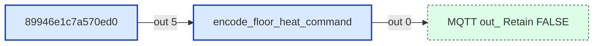

#### Msg contract
Encodes FLOOR_HEAT_COMMAND messages (1FEFB)

#### Upstream
- 89946e1c7a570ed0 (switch) — this tab

#### Downstream
- **Output 0:**
  - MQTT out: Retain FALSE (link out) — this tab

---

### encode_furnace_command
- **File:** [`encode_furnace_command.js`](../tabs/ha-commands/encode_furnace_command.js)
- **Node ID:** `83a24d85bf644847`
- **Outputs:** 1

#### Neighborhood
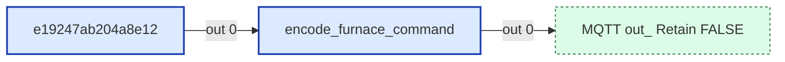

#### Msg contract
Encodes MQTT Climate commands into FURNACE_COMMAND messages (1FFE6)

#### Upstream
- e19247ab204a8e12 (switch) — this tab

#### Downstream
- **Output 0:**
  - MQTT out: Retain FALSE (link out) — this tab

---

### encode_generic_indicator_command
- **File:** [`encode_generic_indicator_command.js`](../tabs/ha-commands/encode_generic_indicator_command.js)
- **Node ID:** `eea2c8f34cb0db28`
- **Outputs:** 1

#### Neighborhood
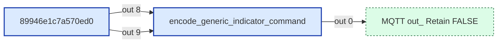

#### Msg contract
Encodes GENERIC_INDICATOR_COMMAND (DGN 1FED9h, §6.26.2)
Handles both routing keys:
  switch_i → instance-targeted command (byte 0 = instance, byte 1 = 0xFF non-group)
  switch_g → group-targeted command   (byte 0 = 0xFF,      byte 1 = group bitmap)

#### Upstream
- 89946e1c7a570ed0 (switch) — this tab

#### Downstream
- **Output 0:**
  - MQTT out: Retain FALSE (link out) — this tab

---

### encode_lock_command
- **File:** [`encode_lock_command.js`](../tabs/ha-commands/encode_lock_command.js)
- **Node ID:** `8a5082e9f29a8080`
- **Outputs:** 1

#### Neighborhood
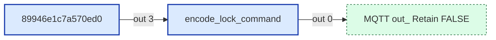

#### Msg contract
Encodes LOCK_COMMAND messages (1FEE4)

#### Upstream
- 89946e1c7a570ed0 (switch) — this tab

#### Downstream
- **Output 0:**
  - MQTT out: Retain FALSE (link out) — this tab

---

### encode_shade_command
- **File:** [`encode_shade_command.js`](../tabs/ha-commands/encode_shade_command.js)
- **Node ID:** `58d9a2789e4a1391`
- **Outputs:** 1

#### Neighborhood
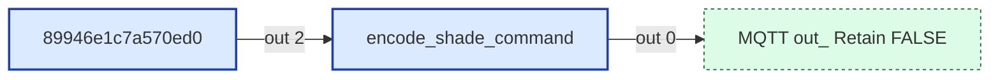

#### Msg contract
Encodes WINDOW_SHADE_COMMAND messages (1FEDF)

#### Upstream
- 89946e1c7a570ed0 (switch) — this tab

#### Downstream
- **Output 0:**
  - MQTT out: Retain FALSE (link out) — this tab

---

### encode_thermostat_command
- **File:** [`encode_thermostat_command.js`](../tabs/ha-commands/encode_thermostat_command.js)
- **Node ID:** `755a5ee01bb1179d`
- **Outputs:** 1

#### Neighborhood
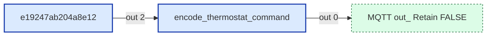

#### Msg contract
Encodes MQTT Climate commands into THERMOSTAT_COMMAND_1 messages (1FEF9)
§6.16.4 — same byte layout as THERMOSTAT_STATUS_1 (§6.16.2b)

Byte 0: Instance
Byte 1: bits 0-3 Operating mode, bits 4-5 Fan mode, bits 6-7 Schedule mode
Byte 2: Fan speed (0-200 at 0.5% per step, 0=auto)
Bytes 3-4: Setpoint heat (uint16 LE, Table 5.3 temperature)
Bytes 5-6: Setpoint cool (uint16 LE, Table 5.3 temperature)
Byte 7: Reserved (0xFF)

#### Upstream
- e19247ab204a8e12 (switch) — this tab

#### Downstream
- **Output 0:**
  - MQTT out: Retain FALSE (link out) — this tab

---

### encode_water_pump_command
- **File:** [`encode_water_pump_command.js`](../tabs/ha-commands/encode_water_pump_command.js)
- **Node ID:** `927786f8f3f21075`
- **Outputs:** 1

#### Neighborhood
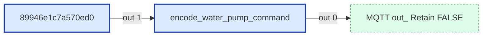

#### Msg contract
Encodes WATER_PUMP_COMMAND messages (1FFB2)

#### Upstream
- 89946e1c7a570ed0 (switch) — this tab

#### Downstream
- **Output 0:**
  - MQTT out: Retain FALSE (link out) — this tab

---

### encode_waterheater_command_2
- **Node ID:** `dd9e8f7c6b5a4321`
- **Outputs:** 1

#### Neighborhood
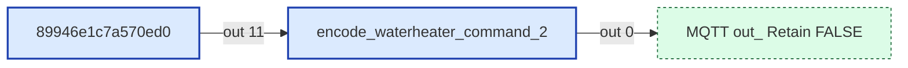

#### Msg contract
Encodes AquaHot 125D switch commands via 1FE98 (WATERHEATER_COMMAND_2) and FF2F (AQUAHOT_COMMAND_2)
Uses FF2F (AQUAHOT_COMMAND_2) cmd_type 0x0a for interior heating priority
Entity IDs: aquahot_diesel_burner, aquahot_electric_element, aquahot_quiet_mode, aquahot_interior_heating

#### Upstream
- 89946e1c7a570ed0 (switch) — this tab

#### Downstream
- **Output 0:**
  - MQTT out: Retain FALSE (link out) — this tab

---

## UI Template Nodes

_None._

## Subflow Instances

_None._

## Link Nodes

### Outbound (link out)
- **MQTT out: Retain FALSE** (`6aa079d768e1571c`) →
  - MQTT out: Retain FALSE in tab `Config` ([wiring](./config.md))
- **MQTT out: Retain FALSE** (`d95299a44e1d7ed5`) →
  - MQTT out: Retain FALSE in tab `Config` ([wiring](./config.md))

### Inbound (link in)
- **HA in** (`a3b957142479c075`) ←
  - HA in in tab `Config`

## Catch / Status Nodes

_None._

## Other Nodes

- 89946e1c7a570ed0 (switch) — id `89946e1c7a570ed0`, in: 1, out: 13
- 9f10dee2300ff666 (note) — id `9f10dee2300ff666`, in: 0, out: 0
- HA climate (mqtt in) — id `51fdd54bd04e39e2`, in: 0, out: 1
- Home Assistant climate encoding (group) — id `7183c5f0ad762adb`, in: 0, out: 0
- Home Assistant command encoding (group) — id `aea9d97e0563bd83`, in: 0, out: 0
- ae2d2a4f790d7cf9 (inject) — id `ae2d2a4f790d7cf9`, in: 0, out: 1
- e19247ab204a8e12 (switch) — id `e19247ab204a8e12`, in: 1, out: 4
- otherwise (debug) — id `31e6105322d72319`, in: 1, out: 0
- otherwise (debug) — id `778971897d2a7fdc`, in: 1, out: 0
