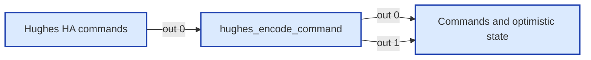
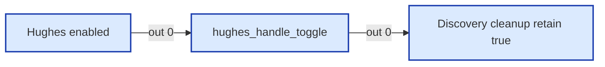
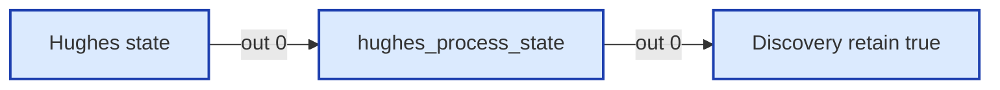

# Wiring Map: Hughes

> Auto-generated by `tools/wiring-map/generate.js`. Do not edit by hand.
> Source: `../hughes.yaml`

## Tab Summary
- **Tab ID:** `8a7f019c3d4e5b60`
- **Disabled:** false
- **Node count:** 11
- **Function nodes:** 3
- **UI template nodes:** 0
- **Subflow instances:** 0
- **Link out (outbound):** 0
- **Link in (inbound):** 0

## Function Nodes

### hughes_encode_command
- **File:** [`hughes_encode_command.js`](../tabs/hughes/hughes_encode_command.js)
- **Node ID:** `5a7f019c3d4e5b66`
- **Outputs:** 2

#### Neighborhood

#### Msg contract
Convert Home Assistant Hughes commands to the add-on MQTT command contract.
Output 1: bridge command. Output 2: optimistic state update.

#### Upstream
- Hughes HA commands (mqtt in) — this tab

#### Downstream
- **Output 0:**
  - Commands and optimistic state (mqtt out) — this tab
- **Output 1:**
  - Commands and optimistic state (mqtt out) — this tab

---

### hughes_handle_toggle
- **File:** [`hughes_handle_toggle.js`](../tabs/hughes/hughes_handle_toggle.js)
- **Node ID:** `8b7f019c3d4e5b69`
- **Outputs:** 1

#### Neighborhood

#### Msg contract
Handles enable/disable of Hughes integration via addon config
Input: msg from librecoach/config/hughes_enabled ("true" / "false")
Output → MQTT Out (entity deletion on disable)

#### Upstream
- Hughes enabled (mqtt in) — this tab

#### Downstream
- **Output 0:**
  - Discovery cleanup retain true (mqtt out) — this tab

---

### hughes_process_state
- **File:** [`hughes_process_state.js`](../tabs/hughes/hughes_process_state.js)
- **Node ID:** `2a7f019c3d4e5b63`
- **Outputs:** 1

#### Neighborhood

#### Msg contract
Create/update Home Assistant MQTT Discovery entities from Hughes BLE state.
Input: librecoach/ble/hughes/{mac}/state
Output: discovery messages for retained MQTT output.

#### Upstream
- Hughes state (mqtt in) — this tab

#### Downstream
- **Output 0:**
  - Discovery retain true (mqtt out) — this tab

---

## UI Template Nodes

_None._

## Subflow Instances

_None._

## Link Nodes

### Outbound (link out)
_None._

### Inbound (link in)
_None._

## Catch / Status Nodes

_None._

## Other Nodes

- 4e3aba05a55488d2 (note) — id `4e3aba05a55488d2`, in: 0, out: 0
- Commands and optimistic state (mqtt out) — id `6a7f019c3d4e5b67`, in: 2, out: 0
- Discovery cleanup retain true (mqtt out) — id `9a7f019c3d4e5b6a`, in: 1, out: 0
- Discovery retain true (mqtt out) — id `3a7f019c3d4e5b64`, in: 1, out: 0
- Hughes HA commands (mqtt in) — id `4a7f019c3d4e5b65`, in: 0, out: 1
- Hughes Power Watchdog (group) — id `e2a57851c2fe7bca`, in: 0, out: 0
- Hughes enabled (mqtt in) — id `7a7f019c3d4e5b68`, in: 0, out: 1
- Hughes state (mqtt in) — id `1a7f019c3d4e5b62`, in: 0, out: 1
