# LibreCoach Node-RED

> Auto-generated by `tools/wiring-map/generate.js`. Do not edit by hand.

## Cross-tab link map

```mermaid
flowchart TD
  classDef fn fill:#dbeafe,stroke:#1e40af,stroke-width:2px
  classDef ui fill:#ede9fe,stroke:#5b21b6,stroke-width:2px
  classDef sub fill:#fef3c7,stroke:#92400e,stroke-width:2px
  classDef link fill:#dcfce7,stroke:#166534,stroke-width:1px,stroke-dasharray:3 3
  classDef config fill:#f3f4f6,stroke:#6b7280,stroke-width:1px,stroke-dasharray:2 2
  classDef disabled opacity:0.5,stroke-dasharray:4 4
  subgraph n_1fde0c4ffb03["Victron"]
    n_2343c8c12f20["Reset Victron"]:::link
    n_71ac45fb64bf["Reset Victron filters"]:::link
    n_8fdd1d506d28["CONFIG_GLOBALS"]:::link
    n_b1b68ff387e0["Reset Victron filters"]:::link
    n_bd38c37850a3["MQTT out_ Retain TRUE"]:::link
    n_db3ce2f66f85["Reset Victron filters"]:::link
    n_e371075d4dbf["MQTT out_ Retain TRUE"]:::link
    n_f3f99ba42088["MQTT out_ Retain TRUE"]:::link
  end
  subgraph n_222c995b7790["Delete HA Entity"]
    n_d38c75bc1474["MQTT out_ Retain TRUE"]:::link
  end
  subgraph n_292e70a6ba25["Config"]
    n_027d23847687["CONFIG_GLOBALS"]:::link
    n_02bdfc59de71["STATUS"]:::link
    n_0a63b31d6180["MQTT out_ Retain TRUE"]:::link
    n_1e244bad0304["Clear unique values"]:::link
    n_398683928338["AQUAHOT"]:::link
    n_45414bacecad["ADDRESS_CLAIMED"]:::link
    n_4fa9b9fdc36c["COMMAND"]:::link
    n_5ffb64e684c2["MQTT out_ Retain TRUE"]:::link
    n_6376d9858936["MQTT out_ Retain TRUE"]:::link
    n_64c5e5cfd438["HA in"]:::link
    n_74329f13cbbc["MQTT out_ Retain FALSE"]:::link
    n_88e5fa035bed["CONFIG_GLOBALS"]:::link
    n_a1e89f48333c["Notify user"]:::link
    n_a2334b77d376["MQTT out_ Retain FALSE"]:::link
    n_ac17a780a9a1["CONFIG_GLOBALS"]:::link
    n_cd73ee739dad["Notify user"]:::link
    n_dca8346e061f["MQTT out_ Retain TRUE"]:::link
    n_de36b6c52fd2["MQTT out_ Retain FALSE"]:::link
    n_e38f32a1f6d3["MQTT out_ Retain TRUE"]:::link
    n_f01db5ebc3ae["ADDRESS_CLAIMED"]:::link
    n_f658418a7b9b["MQTT out_ Retain TRUE"]:::link
  end
  subgraph n_384249601e37["AquaHot"]
    n_1c1403c14b57["MQTT out_ Retain TRUE"]:::link
    n_914be705da05["Waterheater zone"]:::link
    n_cd5a041811bc["AQUAHOT"]:::link
  end
  subgraph n_3e5f038a4f5a["Status routing"]
    n_3f467bbd66a2["Waterheater zone"]:::link
    n_893d80d11250["Reset floor heat"]:::link
    n_d3a13b531bab["MQTT out_ Retain TRUE"]:::link
    n_fbc5efde2c44["STATUS"]:::link
  end
  subgraph n_7ecdba18640c["Command routing"]
    n_00b1afc9a96a["COMMAND"]:::link
    n_102272ba5b34["MQTT out_ Retain TRUE"]:::link
  end
  subgraph n_b3d80c5dc947["HA Commands"]
    n_6aa079d768e1["MQTT out_ Retain FALSE"]:::link
    n_a3b957142479["HA in"]:::link
    n_d95299a44e1d["MQTT out_ Retain FALSE"]:::link
  end
  subgraph n_bfa6336b0d45["Templates"]
    n_12a57f6a07d0["MQTT out_ Retain TRUE"]:::link
    n_47ac3adc971d["Notify user"]:::link
    n_47f3c921ae62["Notify user"]:::link
    n_fa104ff19bbe["Notify user"]:::link
  end
  subgraph n_e3804d2dd0b8["Micro-Air"]
    n_1d411b577497["Reset Microair filters"]:::link
    n_52b505b69f88["MQTT out_ Retain FALSE"]:::link
    n_599ffbccfb7c["MQTT out_ Retain TRUE"]:::link
    n_950e9ce65422["MQTT out_ Retain TRUE"]:::link
    n_a58b5f05c834["Reset Micro-Air"]:::link
    n_b104a7e82aef["MQTT out_ Retain TRUE"]:::link
    n_bb154cf7301d["CONFIG_GLOBALS"]:::link
    n_cdc4754f4c43["Reset Microair filters"]:::link
  end
  n_02bdfc59de71 --> n_fbc5efde2c44
  n_0a63b31d6180 --> n_f658418a7b9b
  n_102272ba5b34 --> n_f658418a7b9b
  n_12a57f6a07d0 --> n_f658418a7b9b
  n_1c1403c14b57 --> n_f658418a7b9b
  n_1e244bad0304 --> n_2343c8c12f20
  n_1e244bad0304 --> n_893d80d11250
  n_1e244bad0304 --> n_a58b5f05c834
  n_398683928338 --> n_00b1afc9a96a
  n_398683928338 --> n_cd5a041811bc
  n_3f467bbd66a2 --> n_914be705da05
  n_45414bacecad --> n_f01db5ebc3ae
  n_47ac3adc971d --> n_a1e89f48333c
  n_47f3c921ae62 --> n_a1e89f48333c
  n_4fa9b9fdc36c --> n_00b1afc9a96a
  n_52b505b69f88 --> n_74329f13cbbc
  n_599ffbccfb7c --> n_f658418a7b9b
  n_5ffb64e684c2 --> n_f658418a7b9b
  n_6376d9858936 --> n_f658418a7b9b
  n_64c5e5cfd438 --> n_a3b957142479
  n_6aa079d768e1 --> n_74329f13cbbc
  n_71ac45fb64bf --> n_b1b68ff387e0
  n_71ac45fb64bf --> n_db3ce2f66f85
  n_88e5fa035bed --> n_027d23847687
  n_88e5fa035bed --> n_8fdd1d506d28
  n_88e5fa035bed --> n_ac17a780a9a1
  n_88e5fa035bed --> n_bb154cf7301d
  n_950e9ce65422 --> n_f658418a7b9b
  n_a2334b77d376 --> n_74329f13cbbc
  n_b104a7e82aef --> n_f658418a7b9b
  n_bd38c37850a3 --> n_f658418a7b9b
  n_cd73ee739dad --> n_a1e89f48333c
  n_cdc4754f4c43 --> n_1d411b577497
  n_d38c75bc1474 --> n_f658418a7b9b
  n_d3a13b531bab --> n_f658418a7b9b
  n_d95299a44e1d --> n_74329f13cbbc
  n_dca8346e061f --> n_f658418a7b9b
  n_de36b6c52fd2 --> n_74329f13cbbc
  n_e371075d4dbf --> n_f658418a7b9b
  n_e38f32a1f6d3 --> n_f658418a7b9b
  n_f3f99ba42088 --> n_f658418a7b9b
  n_fa104ff19bbe --> n_a1e89f48333c
```

## Tabs

| Tab | Functions | Subflow instances | Link out | Link in |
|---|---|---|---|---|
| [Config](./config.md) | 26 | 0 | 15 | 7 |
| [Status routing](./status-routing.md) | 53 | 0 | 2 | 2 |
| [Command routing](./command-routing.md) | 8 | 0 | 1 | 1 |
| [HA Commands](./ha-commands.md) | 14 | 0 | 2 | 1 |
| [AquaHot](./aquahot.md) | 4 | 0 | 1 | 2 |
| [Victron](./victron.md) | 13 | 0 | 4 | 4 |
| [Micro-Air](./micro-air.md) | 9 | 0 | 5 | 3 |
| [Templates](./templates.md) | 15 | 0 | 4 | 0 |
| [Delete HA Entity](./delete-ha-entity.md) | 1 | 0 | 1 | 0 |

## Subflows

_None._

## Cross-tab link map (table)

| From (link out) | Tab | → | To (link in) | Tab |
|---|---|---|---|---|
| STATUS | Config | → | STATUS | Status routing |
| MQTT out: Retain TRUE | Config | → | MQTT out: Retain TRUE | Config |
| MQTT out: Retain TRUE | Command routing | → | MQTT out: Retain TRUE | Config |
| MQTT out: Retain TRUE | Templates | → | MQTT out: Retain TRUE | Config |
| MQTT out: Retain TRUE | AquaHot | → | MQTT out: Retain TRUE | Config |
| Clear unique values | Config | → | Reset Victron | Victron |
| Clear unique values | Config | → | Reset floor heat | Status routing |
| Clear unique values | Config | → | Reset Micro-Air | Micro-Air |
| AQUAHOT | Config | → | COMMAND | Command routing |
| AQUAHOT | Config | → | AQUAHOT | AquaHot |
| Waterheater zone | Status routing | → | Waterheater zone | AquaHot |
| ADDRESS_CLAIMED | Config | → | ADDRESS_CLAIMED | Config |
| Notify user | Templates | → | Notify user | Config |
| Notify user | Templates | → | Notify user | Config |
| COMMAND | Config | → | COMMAND | Command routing |
| MQTT out: Retain FALSE | Micro-Air | → | MQTT out: Retain FALSE | Config |
| MQTT out: Retain TRUE | Micro-Air | → | MQTT out: Retain TRUE | Config |
| MQTT out: Retain TRUE | Config | → | MQTT out: Retain TRUE | Config |
| MQTT out: Retain TRUE | Config | → | MQTT out: Retain TRUE | Config |
| HA in | Config | → | HA in | HA Commands |
| MQTT out: Retain FALSE | HA Commands | → | MQTT out: Retain FALSE | Config |
| Reset Victron filters | Victron | → | Reset Victron filters | Victron |
| Reset Victron filters | Victron | → | Reset Victron filters | Victron |
| CONFIG_GLOBALS | Config | → | CONFIG_GLOBALS | Config |
| CONFIG_GLOBALS | Config | → | CONFIG_GLOBALS | Victron |
| CONFIG_GLOBALS | Config | → | CONFIG_GLOBALS | Config |
| CONFIG_GLOBALS | Config | → | CONFIG_GLOBALS | Micro-Air |
| MQTT out: Retain TRUE | Micro-Air | → | MQTT out: Retain TRUE | Config |
| MQTT out: Retain FALSE | Config | → | MQTT out: Retain FALSE | Config |
| MQTT out: Retain TRUE | Micro-Air | → | MQTT out: Retain TRUE | Config |
| MQTT out: Retain TRUE | Victron | → | MQTT out: Retain TRUE | Config |
| Notify user | Config | → | Notify user | Config |
| Reset Microair filters | Micro-Air | → | Reset Microair filters | Micro-Air |
| MQTT out: Retain TRUE | Delete HA Entity | → | MQTT out: Retain TRUE | Config |
| MQTT out: Retain TRUE | Status routing | → | MQTT out: Retain TRUE | Config |
| MQTT out: Retain FALSE | HA Commands | → | MQTT out: Retain FALSE | Config |
| MQTT out: Retain TRUE | Config | → | MQTT out: Retain TRUE | Config |
| MQTT out: Retain FALSE | Config | → | MQTT out: Retain FALSE | Config |
| MQTT out: Retain TRUE | Victron | → | MQTT out: Retain TRUE | Config |
| MQTT out: Retain TRUE | Config | → | MQTT out: Retain TRUE | Config |
| MQTT out: Retain TRUE | Victron | → | MQTT out: Retain TRUE | Config |
| Notify user | Templates | → | Notify user | Config |

## Config nodes

| Name | Type | Used by |
|---|---|---|
| Home Assistant | server | 1 node across 1 tab |
| Mosquitto | mqtt-broker | 19 nodes across 5 tabs |
| Victron Cerbo GX | mqtt-broker | 4 nodes across 1 tab |
| f32f7fc67467278b | global-config | 0 nodes across 0 tabs |
