# Wiring Map: Status routing

> Auto-generated by `tools/wiring-map/generate.js`. Do not edit by hand.
> Source: `../status-routing.yaml`

## Tab Summary
- **Tab ID:** `3e5f038a4f5a8b9a`
- **Disabled:** false
- **Node count:** 81
- **Function nodes:** 53
- **UI template nodes:** 0
- **Subflow instances:** 0
- **Link out (outbound):** 2
- **Link in (inbound):** 2

## Function Nodes

### Reset function
- **File:** [`Reset function.js`](../tabs/status-routing/Reset function.js)
- **Node ID:** `09640adb1fd08fbb`
- **Outputs:** 1

#### Neighborhood


#### Msg contract
_No documented msg contract._

#### Upstream
- Reset unique (inject) — this tab

#### Downstream
_None._

---

### Reset function
- **File:** [`Reset function(2).js`](../tabs/status-routing/Reset function(2).js)
- **Node ID:** `7a0956cdace18b52`
- **Outputs:** 1

#### Neighborhood
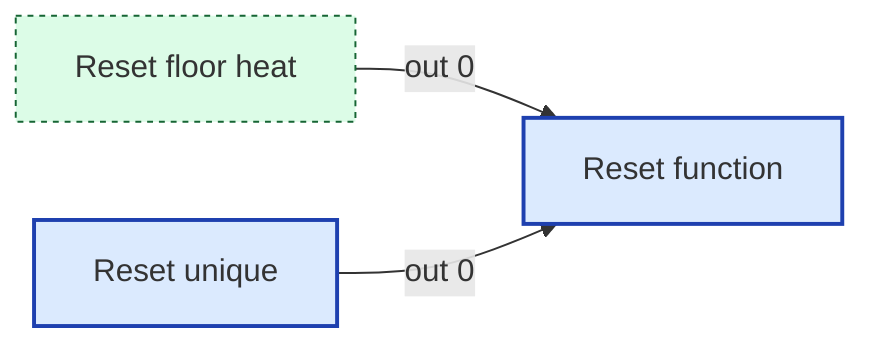

#### Msg contract
_No documented msg contract._

#### Upstream
- Reset floor heat (link in) — this tab
- Reset unique (inject) — this tab

#### Downstream
_None._

---

### Reset function
- **File:** [`Reset function(3).js`](../tabs/status-routing/Reset function(3).js)
- **Node ID:** `870bf91817db9d08`
- **Outputs:** 1

#### Neighborhood


#### Msg contract
--- Reset persistent and in-memory context cleanly ---

#### Upstream
- Reset unique (inject) — this tab

#### Downstream
_None._

---

### beta_gate
- **File:** [`beta_gate.js`](../tabs/status-routing/beta_gate.js)
- **Node ID:** `a51bd40c7da8dc17`
- **Outputs:** 1

#### Neighborhood
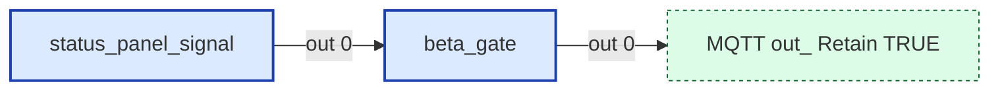

#### Msg contract
A simple gate node to allow messages to pass only if Beta features are enabled.

#### Upstream
- status_panel_signal (function) — this tab, file: [`status_panel_signal.js`](../tabs/status-routing/status_panel_signal.js)

#### Downstream
- **Output 0:**
  - MQTT out: Retain TRUE (link out) — this tab

---

### create_floor_heat
- **File:** [`create_floor_heat.js`](../tabs/status-routing/create_floor_heat.js)
- **Node ID:** `b3e18602b6affaf5`
- **Outputs:** 1

#### Neighborhood


#### Msg contract
Creates Climate entity for FLOOR HEAT

#### Upstream
- unique_floor_heat (function) — this tab, file: [`unique_floor_heat.js`](../tabs/status-routing/unique_floor_heat.js)

#### Downstream
- **Output 0:**
  - MQTT out: Retain TRUE (link out) — this tab

---

### decode_ac_load_status
- **File:** [`decode_ac_load_status.js`](../tabs/status-routing/decode_ac_load_status.js)
- **Node ID:** `c38d48059f463772`
- **Outputs:** 1

#### Neighborhood
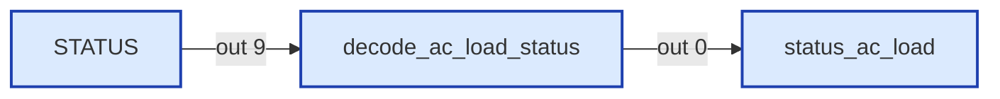

#### Msg contract
Status Updater for AC Load
Decodes AC_LOAD_STATUS messages (1FFBF)

#### Upstream
- STATUS (switch) — this tab

#### Downstream
- **Output 0:**
  - status_ac_load (function) — this tab, file: [`status_ac_load.js`](../tabs/status-routing/status_ac_load.js)

---

### decode_air_conditioner_status
- **File:** [`decode_air_conditioner_status.js`](../tabs/status-routing/decode_air_conditioner_status.js)
- **Node ID:** `5ac8d282ced2b5a1`
- **Outputs:** 1

#### Neighborhood
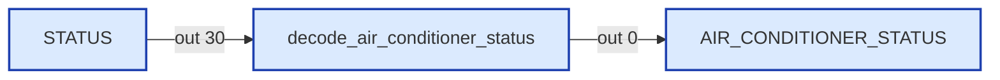

#### Msg contract
Status Updater for Air Conditioner
Decodes AIR_CONDITIONER_STATUS messages (1FFE1)

#### Upstream
- STATUS (switch) — this tab

#### Downstream
- **Output 0:**
  - AIR_CONDITIONER_STATUS (debug) — this tab

---

### decode_ats_ac_status
- **File:** [`decode_ats_ac_status.js`](../tabs/status-routing/decode_ats_ac_status.js)
- **Node ID:** `bacdea9854675b01`
- **Outputs:** 1

#### Neighborhood
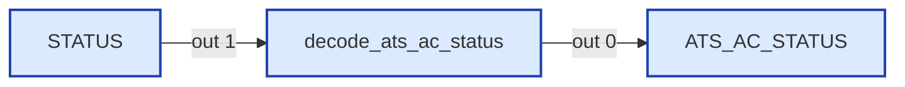

#### Msg contract
Status Updater for ATS AC
Decodes ATS_AC_STATUS messages

#### Upstream
- STATUS (switch) — this tab

#### Downstream
- **Output 0:**
  - ATS_AC_STATUS (debug) — this tab

---

### decode_ats_status
- **File:** [`decode_ats_status.js`](../tabs/status-routing/decode_ats_status.js)
- **Node ID:** `a0357de00b26b002`
- **Outputs:** 1

#### Neighborhood
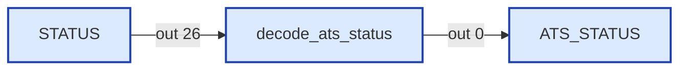

#### Msg contract
Status Updater for ATS
Decodes ATS_STATUS messages (1FF9C)

#### Upstream
- STATUS (switch) — this tab

#### Downstream
- **Output 0:**
  - ATS_STATUS (debug) — this tab

---

### decode_autofill_status
- **File:** [`decode_autofill_status.js`](../tabs/status-routing/decode_autofill_status.js)
- **Node ID:** `96c3c21a4dd0b9bd`
- **Outputs:** 1

#### Neighborhood
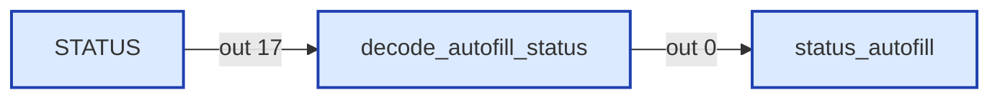

#### Msg contract
Status Updater for Autofill

#### Upstream
- STATUS (switch) — this tab

#### Downstream
- **Output 0:**
  - status_autofill (function) — this tab, file: [`status_autofill.js`](../tabs/status-routing/status_autofill.js)

---

### decode_charger_ac_status
- **File:** [`decode_charger_ac_status.js`](../tabs/status-routing/decode_charger_ac_status.js)
- **Node ID:** `b2bda5ef5e68c98d`
- **Outputs:** 1

#### Neighborhood
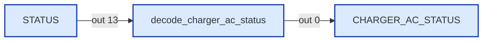

#### Msg contract
Status Updater for Charger AC
Decodes CHARGER_AC_STATUS messages

#### Upstream
- STATUS (switch) — this tab

#### Downstream
- **Output 0:**
  - CHARGER_AC_STATUS (debug) — this tab

---

### decode_charger_status
- **File:** [`decode_charger_status.js`](../tabs/status-routing/decode_charger_status.js)
- **Node ID:** `f171dcbe8b5d2e05`
- **Outputs:** 1

#### Neighborhood
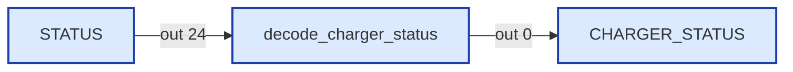

#### Msg contract
Decodes CHARGER_STATUS messages (1FFC7)
RV-C §6.20.8 — CHARGER_STATUS

#### Upstream
- STATUS (switch) — this tab

#### Downstream
- **Output 0:**
  - CHARGER_STATUS (debug) — this tab

---

### decode_circulation_pump_status
- **File:** [`decode_circulation_pump_status.js`](../tabs/status-routing/decode_circulation_pump_status.js)
- **Node ID:** `2d9036a34ecd189a`
- **Outputs:** 1

#### Neighborhood
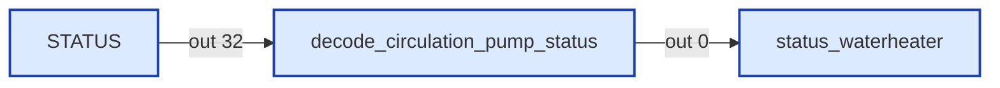

#### Msg contract
Decodes CIRCULATION_PUMP_STATUS messages (1FE97)

#### Upstream
- STATUS (switch) — this tab

#### Downstream
- **Output 0:**
  - status_waterheater (function) — this tab, file: [`status_waterheater.js`](../tabs/status-routing/status_waterheater.js)

---

### decode_dc_dimmer_status_3
- **File:** [`decode_dc_dimmer_status_3.js`](../tabs/status-routing/decode_dc_dimmer_status_3.js)
- **Node ID:** `4a6d57460d64c76f`
- **Outputs:** 1

#### Neighborhood
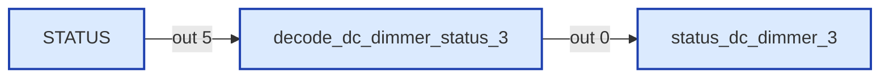

#### Msg contract
DC Dimmer Decoder
Decodes DC_DIMMER_STATUS_1/2/3 messages (1FFBB, 1FFBA, 1FEDA)

#### Upstream
- STATUS (switch) — this tab

#### Downstream
- **Output 0:**
  - status_dc_dimmer_3 (function) — this tab, file: [`status_dc_dimmer_3.js`](../tabs/status-routing/status_dc_dimmer_3.js)

---

### decode_dc_driver_status
- **File:** [`decode_dc_driver_status.js`](../tabs/status-routing/decode_dc_driver_status.js)
- **Node ID:** `a037b4692cc9f1dd`
- **Outputs:** 1

#### Neighborhood
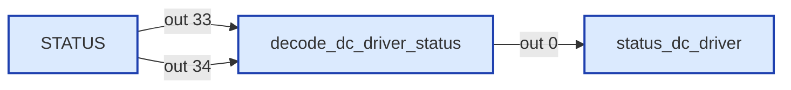

#### Msg contract
Decode DC Component Driver Status Messages (16F00 - 16300)

#### Upstream
- STATUS (switch) — this tab

#### Downstream
- **Output 0:**
  - status_dc_driver (function) — this tab, file: [`status_dc_driver.js`](../tabs/status-routing/status_dc_driver.js)

---

### decode_dc_load_status
- **File:** [`decode_dc_load_status.js`](../tabs/status-routing/decode_dc_load_status.js)
- **Node ID:** `d08c9978d8bb33d4`
- **Outputs:** 1

#### Neighborhood
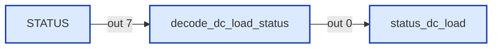

#### Msg contract
Decoder for DC_LOAD_STATUS (DGN 1FFBDh, §6.23.2)
Input: msg.payload from decode_rvc_can (dgn, dgn_name, data_payload)
Output: decoded fields merged into payload

#### Upstream
- STATUS (switch) — this tab

#### Downstream
- **Output 0:**
  - status_dc_load (function) — this tab, file: [`status_dc_load.js`](../tabs/status-routing/status_dc_load.js)

---

### decode_dc_source_status
- **File:** [`decode_dc_source_status.js`](../tabs/status-routing/decode_dc_source_status.js)
- **Node ID:** `010c5119a7e833b2`
- **Outputs:** 1

#### Neighborhood
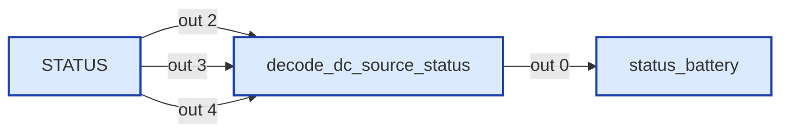

#### Msg contract
Status Updater for DC Source
Decodes DC_SOURCE_STATUS_1/2/3 messages (1FFFD/C/B)

#### Upstream
- STATUS (switch) — this tab

#### Downstream
- **Output 0:**
  - status_battery (function) — this tab, file: [`status_battery.js`](../tabs/status-routing/status_battery.js)

---

### decode_floor_heat_status
- **File:** [`decode_floor_heat_status.js`](../tabs/status-routing/decode_floor_heat_status.js)
- **Node ID:** `cd9d55c23ebcee86`
- **Outputs:** 1

#### Neighborhood
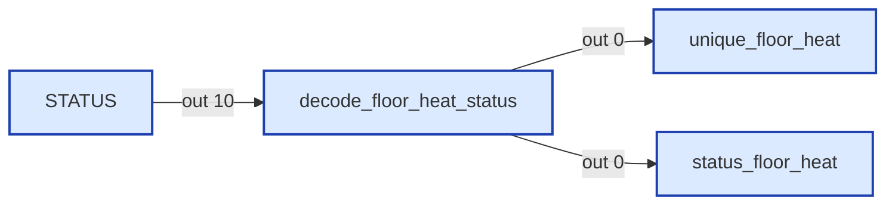

#### Msg contract
Status Updater for Floor Heat
Decodes FLOOR_HEAT_STATUS messages (1FEFC)

#### Upstream
- STATUS (switch) — this tab

#### Downstream
- **Output 0:**
  - status_floor_heat (function) — this tab, file: [`status_floor_heat.js`](../tabs/status-routing/status_floor_heat.js)
  - unique_floor_heat (function) — this tab, file: [`unique_floor_heat.js`](../tabs/status-routing/unique_floor_heat.js)

---

### decode_furnace_status
- **File:** [`decode_furnace_status.js`](../tabs/status-routing/decode_furnace_status.js)
- **Node ID:** `d76a4a48e1beaed6`
- **Outputs:** 1

#### Neighborhood
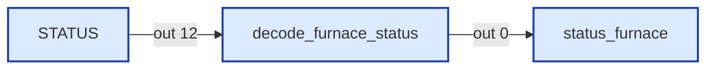

#### Msg contract
Decodes FURNACE_STATUS messages (1FFE4)
RV-C spec 6.15.2

#### Upstream
- STATUS (switch) — this tab

#### Downstream
- **Output 0:**
  - status_furnace (function) — this tab, file: [`status_furnace.js`](../tabs/status-routing/status_furnace.js)

---

### decode_generator_ac_status
- **File:** [`decode_generator_ac_status.js`](../tabs/status-routing/decode_generator_ac_status.js)
- **Node ID:** `f82e60f4adb5e60b`
- **Outputs:** 1

#### Neighborhood
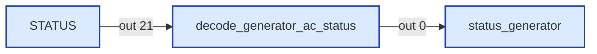

#### Msg contract
Decodes GENERATOR_AC_STATUS_1 messages (1FFDF)
Instance byte §6.18.2: bits 0-3 = Output Instance, bits 4-7 = Line

#### Upstream
- STATUS (switch) — this tab

#### Downstream
- **Output 0:**
  - status_generator (function) — this tab, file: [`status_generator.js`](../tabs/status-routing/status_generator.js)

---

### decode_generator_demand_status
- **File:** [`decode_generator_demand_status.js`](../tabs/status-routing/decode_generator_demand_status.js)
- **Node ID:** `e5d61c5724c6ed1b`
- **Outputs:** 1

#### Neighborhood
```mermaid
flowchart LR
  classDef fn fill:#dbeafe,stroke:#1e40af,stroke-width:2px
  classDef ui fill:#ede9fe,stroke:#5b21b6,stroke-width:2px
  classDef sub fill:#fef3c7,stroke:#92400e,stroke-width:2px
  classDef link fill:#dcfce7,stroke:#166534,stroke-width:1px,stroke-dasharray:3 3
  classDef config fill:#f3f4f6,stroke:#6b7280,stroke-width:1px,stroke-dasharray:2 2
  classDef disabled opacity:0.5,stroke-dasharray:4 4
  n_906e4d6a45bb["status_generator"]:::fn
  n_9f88f215f3f0["STATUS"]:::fn
  n_e5d61c5724c6["decode_generator_demand_status"]:::fn
  n_9f88f215f3f0 -->|out 22| n_e5d61c5724c6
  n_e5d61c5724c6 -->|out 0| n_906e4d6a45bb
```

#### Msg contract
Decodes GENERATOR_DEMAND_STATUS messages (1FF80)
RV-C §6.35.2

#### Upstream
- STATUS (switch) — this tab

#### Downstream
- **Output 0:**
  - status_generator (function) — this tab, file: [`status_generator.js`](../tabs/status-routing/status_generator.js)

---

### decode_generator_status
- **File:** [`decode_generator_status.js`](../tabs/status-routing/decode_generator_status.js)
- **Node ID:** `6b27f0f99ea11a72`
- **Outputs:** 1

#### Neighborhood
```mermaid
flowchart LR
  classDef fn fill:#dbeafe,stroke:#1e40af,stroke-width:2px
  classDef ui fill:#ede9fe,stroke:#5b21b6,stroke-width:2px
  classDef sub fill:#fef3c7,stroke:#92400e,stroke-width:2px
  classDef link fill:#dcfce7,stroke:#166534,stroke-width:1px,stroke-dasharray:3 3
  classDef config fill:#f3f4f6,stroke:#6b7280,stroke-width:1px,stroke-dasharray:2 2
  classDef disabled opacity:0.5,stroke-dasharray:4 4
  n_6b27f0f99ea1["decode_generator_status"]:::fn
  n_906e4d6a45bb["status_generator"]:::fn
  n_9f88f215f3f0["STATUS"]:::fn
  n_6b27f0f99ea1 -->|out 0| n_906e4d6a45bb
  n_9f88f215f3f0 -->|out 20| n_6b27f0f99ea1
```

#### Msg contract
Decodes GENERATOR_STATUS_1 (1FFDC) and GENERATOR_STATUS_2 (1FFDB) messages
RV-C spec 6.18.23 and 6.18.24

#### Upstream
- STATUS (switch) — this tab

#### Downstream
- **Output 0:**
  - status_generator (function) — this tab, file: [`status_generator.js`](../tabs/status-routing/status_generator.js)

---

### decode_inverter_ac_status
- **File:** [`decode_inverter_ac_status.js`](../tabs/status-routing/decode_inverter_ac_status.js)
- **Node ID:** `9621acf15d833362`
- **Outputs:** 1

#### Neighborhood
```mermaid
flowchart LR
  classDef fn fill:#dbeafe,stroke:#1e40af,stroke-width:2px
  classDef ui fill:#ede9fe,stroke:#5b21b6,stroke-width:2px
  classDef sub fill:#fef3c7,stroke:#92400e,stroke-width:2px
  classDef link fill:#dcfce7,stroke:#166534,stroke-width:1px,stroke-dasharray:3 3
  classDef config fill:#f3f4f6,stroke:#6b7280,stroke-width:1px,stroke-dasharray:2 2
  classDef disabled opacity:0.5,stroke-dasharray:4 4
  n_91cac903d306["INVERTER_AC_STATUS"]:::fn
  n_9621acf15d83["decode_inverter_ac_status"]:::fn
  n_9f88f215f3f0["STATUS"]:::fn
  n_9621acf15d83 -->|out 0| n_91cac903d306
  n_9f88f215f3f0 -->|out 14| n_9621acf15d83
```

#### Msg contract
Status Updater for Inverter AC
Decodes INVERTER_AC_STATUS

#### Upstream
- STATUS (switch) — this tab

#### Downstream
- **Output 0:**
  - INVERTER_AC_STATUS (debug) — this tab

---

### decode_inverter_dc_status
- **File:** [`decode_inverter_dc_status.js`](../tabs/status-routing/decode_inverter_dc_status.js)
- **Node ID:** `b91d72f6d383c0d6`
- **Outputs:** 1

#### Neighborhood
```mermaid
flowchart LR
  classDef fn fill:#dbeafe,stroke:#1e40af,stroke-width:2px
  classDef ui fill:#ede9fe,stroke:#5b21b6,stroke-width:2px
  classDef sub fill:#fef3c7,stroke:#92400e,stroke-width:2px
  classDef link fill:#dcfce7,stroke:#166534,stroke-width:1px,stroke-dasharray:3 3
  classDef config fill:#f3f4f6,stroke:#6b7280,stroke-width:1px,stroke-dasharray:2 2
  classDef disabled opacity:0.5,stroke-dasharray:4 4
  n_04bc7637ee71["INVERTER_DC_STATUS"]:::fn
  n_9f88f215f3f0["STATUS"]:::fn
  n_b91d72f6d383["decode_inverter_dc_status"]:::fn
  n_9f88f215f3f0 -->|out 25| n_b91d72f6d383
  n_b91d72f6d383 -->|out 0| n_04bc7637ee71
```

#### Msg contract
Status Updater for Inverter DC
Decodes INVERTER_DC_STATUS messages

#### Upstream
- STATUS (switch) — this tab

#### Downstream
- **Output 0:**
  - INVERTER_DC_STATUS (debug) — this tab

---

### decode_inverter_status
- **File:** [`decode_inverter_status.js`](../tabs/status-routing/decode_inverter_status.js)
- **Node ID:** `cb64b7a9a87f03cc`
- **Outputs:** 1

#### Neighborhood
```mermaid
flowchart LR
  classDef fn fill:#dbeafe,stroke:#1e40af,stroke-width:2px
  classDef ui fill:#ede9fe,stroke:#5b21b6,stroke-width:2px
  classDef sub fill:#fef3c7,stroke:#92400e,stroke-width:2px
  classDef link fill:#dcfce7,stroke:#166534,stroke-width:1px,stroke-dasharray:3 3
  classDef config fill:#f3f4f6,stroke:#6b7280,stroke-width:1px,stroke-dasharray:2 2
  classDef disabled opacity:0.5,stroke-dasharray:4 4
  n_9f3a9fd8a450["INVERTER_STATUS"]:::fn
  n_9f88f215f3f0["STATUS"]:::fn
  n_cb64b7a9a87f["decode_inverter_status"]:::fn
  n_9f88f215f3f0 -->|out 15| n_cb64b7a9a87f
  n_cb64b7a9a87f -->|out 0| n_9f3a9fd8a450
```

#### Msg contract
Decodes INVERTER_STATUS messages (1FFD4)
RV-C §6.19.8 — INVERTER_STATUS

#### Upstream
- STATUS (switch) — this tab

#### Downstream
- **Output 0:**
  - INVERTER_STATUS (debug) — this tab

---

### decode_lock_status
- **File:** [`decode_lock_status.js`](../tabs/status-routing/decode_lock_status.js)
- **Node ID:** `eb3524b2b7bf51e5`
- **Outputs:** 1

#### Neighborhood
```mermaid
flowchart LR
  classDef fn fill:#dbeafe,stroke:#1e40af,stroke-width:2px
  classDef ui fill:#ede9fe,stroke:#5b21b6,stroke-width:2px
  classDef sub fill:#fef3c7,stroke:#92400e,stroke-width:2px
  classDef link fill:#dcfce7,stroke:#166534,stroke-width:1px,stroke-dasharray:3 3
  classDef config fill:#f3f4f6,stroke:#6b7280,stroke-width:1px,stroke-dasharray:2 2
  classDef disabled opacity:0.5,stroke-dasharray:4 4
  n_9f88f215f3f0["STATUS"]:::fn
  n_c853244d3f2e["status_lock"]:::fn
  n_eb3524b2b7bf["decode_lock_status"]:::fn
  n_9f88f215f3f0 -->|out 11| n_eb3524b2b7bf
  n_eb3524b2b7bf -->|out 0| n_c853244d3f2e
```

#### Msg contract
Status Updater for Lock
Decodes LOCK_STATUS messages (1FEE5)

#### Upstream
- STATUS (switch) — this tab

#### Downstream
- **Output 0:**
  - status_lock (function) — this tab, file: [`status_lock.js`](../tabs/status-routing/status_lock.js)

---

### decode_panel_signal
- **File:** [`decode_panel_signal.js`](../tabs/status-routing/decode_panel_signal.js)
- **Node ID:** `e7fac0a7c08bbb90`
- **Outputs:** 1

#### Neighborhood
```mermaid
flowchart LR
  classDef fn fill:#dbeafe,stroke:#1e40af,stroke-width:2px
  classDef ui fill:#ede9fe,stroke:#5b21b6,stroke-width:2px
  classDef sub fill:#fef3c7,stroke:#92400e,stroke-width:2px
  classDef link fill:#dcfce7,stroke:#166534,stroke-width:1px,stroke-dasharray:3 3
  classDef config fill:#f3f4f6,stroke:#6b7280,stroke-width:1px,stroke-dasharray:2 2
  classDef disabled opacity:0.5,stroke-dasharray:4 4
  n_5c41990fd6be["decode_panel_signal"]:::fn
  n_9f88f215f3f0["STATUS"]:::fn
  n_be06adcac3cc["status_panel_signal"]:::fn
  n_e7fac0a7c08b["decode_panel_signal"]:::fn
  n_9f88f215f3f0 -->|out 35| n_e7fac0a7c08b
  n_e7fac0a7c08b -->|out 0| n_5c41990fd6be
  n_e7fac0a7c08b -->|out 0| n_be06adcac3cc
```

#### Msg contract
Decoder for proprietary wireless panel signal messages.
Handles two coach-specific DGNs observed in the field:
- BF00h: per-panel live RF metric, likely raw signal strength
- 1AA00h: per-panel coarse signal-quality companion, likely display bars/state

#### Upstream
- STATUS (switch) — this tab

#### Downstream
- **Output 0:**
  - decode_panel_signal (debug) — this tab
  - status_panel_signal (function) — this tab, file: [`status_panel_signal.js`](../tabs/status-routing/status_panel_signal.js)

---

### decode_tank_status
- **File:** [`decode_tank_status.js`](../tabs/status-routing/decode_tank_status.js)
- **Node ID:** `2e5425d73a166c9b`
- **Outputs:** 1

#### Neighborhood
```mermaid
flowchart LR
  classDef fn fill:#dbeafe,stroke:#1e40af,stroke-width:2px
  classDef ui fill:#ede9fe,stroke:#5b21b6,stroke-width:2px
  classDef sub fill:#fef3c7,stroke:#92400e,stroke-width:2px
  classDef link fill:#dcfce7,stroke:#166534,stroke-width:1px,stroke-dasharray:3 3
  classDef config fill:#f3f4f6,stroke:#6b7280,stroke-width:1px,stroke-dasharray:2 2
  classDef disabled opacity:0.5,stroke-dasharray:4 4
  n_2e5425d73a16["decode_tank_status"]:::fn
  n_6dc4171b23e1["status_tank"]:::fn
  n_9f88f215f3f0["STATUS"]:::fn
  n_2e5425d73a16 -->|out 0| n_6dc4171b23e1
  n_9f88f215f3f0 -->|out 8| n_2e5425d73a16
```

#### Msg contract
Status Updater for Tank
Decodes TANK_STATUS messages (1FFB7)

#### Upstream
- STATUS (switch) — this tab

#### Downstream
- **Output 0:**
  - status_tank (function) — this tab, file: [`status_tank.js`](../tabs/status-routing/status_tank.js)

---

### decode_thermostat_ambient_status
- **File:** [`decode_thermostat_ambient_status.js`](../tabs/status-routing/decode_thermostat_ambient_status.js)
- **Node ID:** `1bb521d55aeb5eba`
- **Outputs:** 1

#### Neighborhood
```mermaid
flowchart LR
  classDef fn fill:#dbeafe,stroke:#1e40af,stroke-width:2px
  classDef ui fill:#ede9fe,stroke:#5b21b6,stroke-width:2px
  classDef sub fill:#fef3c7,stroke:#92400e,stroke-width:2px
  classDef link fill:#dcfce7,stroke:#166534,stroke-width:1px,stroke-dasharray:3 3
  classDef config fill:#f3f4f6,stroke:#6b7280,stroke-width:1px,stroke-dasharray:2 2
  classDef disabled opacity:0.5,stroke-dasharray:4 4
  n_1bb521d55aeb["decode_thermostat_ambient_status"]:::fn
  n_47b68581ce35["status_thermostat_ambient"]:::fn
  n_9f88f215f3f0["STATUS"]:::fn
  n_1bb521d55aeb -->|out 0| n_47b68581ce35
  n_9f88f215f3f0 -->|out 0| n_1bb521d55aeb
```

#### Msg contract
Decodes THERMOSTAT_AMBIENT_STATUS messages (1FF9C)
RV-C §6.16.11 — THERMOSTAT_AMBIENT_STATUS
Message format: 3 bytes only (B0=instance, B1-2=ambient temp uint16)

#### Upstream
- STATUS (switch) — this tab

#### Downstream
- **Output 0:**
  - status_thermostat_ambient (function) — this tab, file: [`status_thermostat_ambient.js`](../tabs/status-routing/status_thermostat_ambient.js)

---

### decode_thermostat_status_1
- **File:** [`decode_thermostat_status_1.js`](../tabs/status-routing/decode_thermostat_status_1.js)
- **Node ID:** `ccec30ad0f32bbdf`
- **Outputs:** 1

#### Neighborhood
```mermaid
flowchart LR
  classDef fn fill:#dbeafe,stroke:#1e40af,stroke-width:2px
  classDef ui fill:#ede9fe,stroke:#5b21b6,stroke-width:2px
  classDef sub fill:#fef3c7,stroke:#92400e,stroke-width:2px
  classDef link fill:#dcfce7,stroke:#166534,stroke-width:1px,stroke-dasharray:3 3
  classDef config fill:#f3f4f6,stroke:#6b7280,stroke-width:1px,stroke-dasharray:2 2
  classDef disabled opacity:0.5,stroke-dasharray:4 4
  n_6836e2852938["status_thermostat"]:::fn
  n_9f88f215f3f0["STATUS"]:::fn
  n_ccec30ad0f32["decode_thermostat_status_1"]:::fn
  n_9f88f215f3f0 -->|out 18| n_ccec30ad0f32
  n_ccec30ad0f32 -->|out 0| n_6836e2852938
```

#### Msg contract
Decodes THERMOSTAT_STATUS_1 messages (1FFE2)
RV-C §6.16.2 — THERMOSTAT_STATUS_1

#### Upstream
- STATUS (switch) — this tab

#### Downstream
- **Output 0:**
  - status_thermostat (function) — this tab, file: [`status_thermostat.js`](../tabs/status-routing/status_thermostat.js)

---

### decode_thermostat_status_2
- **File:** [`decode_thermostat_status_2.js`](../tabs/status-routing/decode_thermostat_status_2.js)
- **Node ID:** `ae9f041c9cd36bb9`
- **Outputs:** 1

#### Neighborhood
```mermaid
flowchart LR
  classDef fn fill:#dbeafe,stroke:#1e40af,stroke-width:2px
  classDef ui fill:#ede9fe,stroke:#5b21b6,stroke-width:2px
  classDef sub fill:#fef3c7,stroke:#92400e,stroke-width:2px
  classDef link fill:#dcfce7,stroke:#166534,stroke-width:1px,stroke-dasharray:3 3
  classDef config fill:#f3f4f6,stroke:#6b7280,stroke-width:1px,stroke-dasharray:2 2
  classDef disabled opacity:0.5,stroke-dasharray:4 4
  n_9f88f215f3f0["STATUS"]:::fn
  n_ae9f041c9cd3["decode_thermostat_status_2"]:::fn
  n_e06ff8584295["THERMOSTAT_STATUS_2"]:::fn
  n_9f88f215f3f0 -->|out 19| n_ae9f041c9cd3
  n_ae9f041c9cd3 -->|out 0| n_e06ff8584295
```

#### Msg contract
Status Updater for Thermostat Ext
Decodes THERMOSTAT_STATUS_2 messages (1FEE0)

#### Upstream
- STATUS (switch) — this tab

#### Downstream
- **Output 0:**
  - THERMOSTAT_STATUS_2 (debug) — this tab

---

### decode_water_pump_status
- **File:** [`decode_water_pump_status.js`](../tabs/status-routing/decode_water_pump_status.js)
- **Node ID:** `9e8e5609c54fec82`
- **Outputs:** 1

#### Neighborhood
```mermaid
flowchart LR
  classDef fn fill:#dbeafe,stroke:#1e40af,stroke-width:2px
  classDef ui fill:#ede9fe,stroke:#5b21b6,stroke-width:2px
  classDef sub fill:#fef3c7,stroke:#92400e,stroke-width:2px
  classDef link fill:#dcfce7,stroke:#166534,stroke-width:1px,stroke-dasharray:3 3
  classDef config fill:#f3f4f6,stroke:#6b7280,stroke-width:1px,stroke-dasharray:2 2
  classDef disabled opacity:0.5,stroke-dasharray:4 4
  n_9e8e5609c54f["decode_water_pump_status"]:::fn
  n_9f88f215f3f0["STATUS"]:::fn
  n_c3c4a8bcea02["status_water_pump"]:::fn
  n_9e8e5609c54f -->|out 0| n_c3c4a8bcea02
  n_9f88f215f3f0 -->|out 16| n_9e8e5609c54f
```

#### Msg contract
Status Updater for Water Pump
Decodes WATER_PUMP_STATUS messages (1FFB3)

#### Upstream
- STATUS (switch) — this tab

#### Downstream
- **Output 0:**
  - status_water_pump (function) — this tab, file: [`status_water_pump.js`](../tabs/status-routing/status_water_pump.js)

---

### decode_waterheater_status
- **File:** [`decode_waterheater_status.js`](../tabs/status-routing/decode_waterheater_status.js)
- **Node ID:** `5bb6491915c598ce`
- **Outputs:** 1

#### Neighborhood
```mermaid
flowchart LR
  classDef fn fill:#dbeafe,stroke:#1e40af,stroke-width:2px
  classDef ui fill:#ede9fe,stroke:#5b21b6,stroke-width:2px
  classDef sub fill:#fef3c7,stroke:#92400e,stroke-width:2px
  classDef link fill:#dcfce7,stroke:#166534,stroke-width:1px,stroke-dasharray:3 3
  classDef config fill:#f3f4f6,stroke:#6b7280,stroke-width:1px,stroke-dasharray:2 2
  classDef disabled opacity:0.5,stroke-dasharray:4 4
  n_3f467bbd66a2["Waterheater zone"]:::link
  n_5bb6491915c5["decode_waterheater_status"]:::fn
  n_647ce51ee8a2["status_waterheater"]:::fn
  n_9f88f215f3f0["STATUS"]:::fn
  n_5bb6491915c5 -->|out 0| n_3f467bbd66a2
  n_5bb6491915c5 -->|out 0| n_647ce51ee8a2
  n_9f88f215f3f0 -->|out 31| n_5bb6491915c5
```

#### Msg contract
Combined decoder for WATERHEATER_STATUS (1FFF7) and WATERHEATER_STATUS_2 (1FE99)
RV-C spec 6.9.2 and 6.9.4

#### Upstream
- STATUS (switch) — this tab

#### Downstream
- **Output 0:**
  - Waterheater zone (link out) — this tab
  - status_waterheater (function) — this tab, file: [`status_waterheater.js`](../tabs/status-routing/status_waterheater.js)

---

### decode_window_shade_control_status
- **File:** [`decode_window_shade_control_status.js`](../tabs/status-routing/decode_window_shade_control_status.js)
- **Node ID:** `3b2f348b9326267c`
- **Outputs:** 1

#### Neighborhood
```mermaid
flowchart LR
  classDef fn fill:#dbeafe,stroke:#1e40af,stroke-width:2px
  classDef ui fill:#ede9fe,stroke:#5b21b6,stroke-width:2px
  classDef sub fill:#fef3c7,stroke:#92400e,stroke-width:2px
  classDef link fill:#dcfce7,stroke:#166534,stroke-width:1px,stroke-dasharray:3 3
  classDef config fill:#f3f4f6,stroke:#6b7280,stroke-width:1px,stroke-dasharray:2 2
  classDef disabled opacity:0.5,stroke-dasharray:4 4
  n_3b2f348b9326["decode_window_shade_control_status"]:::fn
  n_9f88f215f3f0["STATUS"]:::fn
  n_ad388870b715["status_shade"]:::fn
  n_3b2f348b9326 -->|out 0| n_ad388870b715
  n_9f88f215f3f0 -->|out 6| n_3b2f348b9326
```

#### Msg contract
Status Updater for Window Shade
Decodes WINDOW_SHADE_CONTROL_STATUS messages (1FEDE)

#### Upstream
- STATUS (switch) — this tab

#### Downstream
- **Output 0:**
  - status_shade (function) — this tab, file: [`status_shade.js`](../tabs/status-routing/status_shade.js)

---

### status_ac_load
- **File:** [`status_ac_load.js`](../tabs/status-routing/status_ac_load.js)
- **Node ID:** `f36ccb373852dd16`
- **Outputs:** 1

#### Neighborhood
```mermaid
flowchart LR
  classDef fn fill:#dbeafe,stroke:#1e40af,stroke-width:2px
  classDef ui fill:#ede9fe,stroke:#5b21b6,stroke-width:2px
  classDef sub fill:#fef3c7,stroke:#92400e,stroke-width:2px
  classDef link fill:#dcfce7,stroke:#166534,stroke-width:1px,stroke-dasharray:3 3
  classDef config fill:#f3f4f6,stroke:#6b7280,stroke-width:1px,stroke-dasharray:2 2
  classDef disabled opacity:0.5,stroke-dasharray:4 4
  n_c38d48059f46["decode_ac_load_status"]:::fn
  n_d3a13b531bab["MQTT out_ Retain TRUE"]:::link
  n_f36ccb373852["status_ac_load"]:::fn
  n_c38d48059f46 -->|out 0| n_f36ccb373852
  n_f36ccb373852 -->|out 0| n_d3a13b531bab
```

#### Msg contract
HA Status Publisher for AC Load (DGN 1FFBFh, §6.22.2)
Self-creating: publishes MQTT discovery on first valid reading per instance.
Output 1: MQTT messages (discovery + state)
Entity naming: switch_ac_N (routing key "switch_a"), "Switches" device.

#### Upstream
- decode_ac_load_status (function) — this tab, file: [`decode_ac_load_status.js`](../tabs/status-routing/decode_ac_load_status.js)

#### Downstream
- **Output 0:**
  - MQTT out: Retain TRUE (link out) — this tab

---

### status_autofill
- **File:** [`status_autofill.js`](../tabs/status-routing/status_autofill.js)
- **Node ID:** `5004281b11ec3bd7`
- **Outputs:** 1

#### Neighborhood
```mermaid
flowchart LR
  classDef fn fill:#dbeafe,stroke:#1e40af,stroke-width:2px
  classDef ui fill:#ede9fe,stroke:#5b21b6,stroke-width:2px
  classDef sub fill:#fef3c7,stroke:#92400e,stroke-width:2px
  classDef link fill:#dcfce7,stroke:#166534,stroke-width:1px,stroke-dasharray:3 3
  classDef config fill:#f3f4f6,stroke:#6b7280,stroke-width:1px,stroke-dasharray:2 2
  classDef disabled opacity:0.5,stroke-dasharray:4 4
  n_5004281b11ec["status_autofill"]:::fn
  n_96c3c21a4dd0["decode_autofill_status"]:::fn
  n_d3a13b531bab["MQTT out_ Retain TRUE"]:::link
  n_5004281b11ec -->|out 0| n_d3a13b531bab
  n_96c3c21a4dd0 -->|out 0| n_5004281b11ec
```

#### Msg contract
HA Status Publisher for Autofill
Self-creating: publishes MQTT discovery on first valid reading.
Output 1: MQTT messages (discovery + state)

#### Upstream
- decode_autofill_status (function) — this tab, file: [`decode_autofill_status.js`](../tabs/status-routing/decode_autofill_status.js)

#### Downstream
- **Output 0:**
  - MQTT out: Retain TRUE (link out) — this tab

---

### status_battery
- **File:** [`status_battery.js`](../tabs/status-routing/status_battery.js)
- **Node ID:** `2c1151c97bb185f2`
- **Outputs:** 1

#### Neighborhood
```mermaid
flowchart LR
  classDef fn fill:#dbeafe,stroke:#1e40af,stroke-width:2px
  classDef ui fill:#ede9fe,stroke:#5b21b6,stroke-width:2px
  classDef sub fill:#fef3c7,stroke:#92400e,stroke-width:2px
  classDef link fill:#dcfce7,stroke:#166534,stroke-width:1px,stroke-dasharray:3 3
  classDef config fill:#f3f4f6,stroke:#6b7280,stroke-width:1px,stroke-dasharray:2 2
  classDef disabled opacity:0.5,stroke-dasharray:4 4
  n_010c5119a7e8["decode_dc_source_status"]:::fn
  n_2c1151c97bb1["status_battery"]:::fn
  n_d3a13b531bab["MQTT out_ Retain TRUE"]:::link
  n_010c5119a7e8 -->|out 0| n_2c1151c97bb1
  n_2c1151c97bb1 -->|out 0| n_d3a13b531bab
```

#### Msg contract
HA Status Publisher for Battery (DC_SOURCE_STATUS, §6.22)
Self-creating: publishes MQTT discovery on first valid reading per instance.
Output 1: MQTT messages (discovery + state)

#### Upstream
- decode_dc_source_status (function) — this tab, file: [`decode_dc_source_status.js`](../tabs/status-routing/decode_dc_source_status.js)

#### Downstream
- **Output 0:**
  - MQTT out: Retain TRUE (link out) — this tab

---

### status_dc_dimmer_3
- **File:** [`status_dc_dimmer_3.js`](../tabs/status-routing/status_dc_dimmer_3.js)
- **Node ID:** `48e3b18cb440da52`
- **Outputs:** 1

#### Neighborhood
```mermaid
flowchart LR
  classDef fn fill:#dbeafe,stroke:#1e40af,stroke-width:2px
  classDef ui fill:#ede9fe,stroke:#5b21b6,stroke-width:2px
  classDef sub fill:#fef3c7,stroke:#92400e,stroke-width:2px
  classDef link fill:#dcfce7,stroke:#166534,stroke-width:1px,stroke-dasharray:3 3
  classDef config fill:#f3f4f6,stroke:#6b7280,stroke-width:1px,stroke-dasharray:2 2
  classDef disabled opacity:0.5,stroke-dasharray:4 4
  n_48e3b18cb440["status_dc_dimmer_3"]:::fn
  n_4a6d57460d64["decode_dc_dimmer_status_3"]:::fn
  n_d3a13b531bab["MQTT out_ Retain TRUE"]:::link
  n_48e3b18cb440 -->|out 0| n_d3a13b531bab
  n_4a6d57460d64 -->|out 0| n_48e3b18cb440
```

#### Msg contract
HA Status Publisher for DC Dimmer (STATUS_3 1FEDAh §6.23.6 + STATUS_1 1FFBBh §6.23.3)
Self-creating: publishes MQTT discovery on first valid reading per instance.
Output 1: MQTT messages (discovery + state)
Entity naming: switch_N (routing key "switch"), "Switches" device.

#### Upstream
- decode_dc_dimmer_status_3 (function) — this tab, file: [`decode_dc_dimmer_status_3.js`](../tabs/status-routing/decode_dc_dimmer_status_3.js)

#### Downstream
- **Output 0:**
  - MQTT out: Retain TRUE (link out) — this tab

---

### status_dc_driver
- **File:** [`status_dc_driver.js`](../tabs/status-routing/status_dc_driver.js)
- **Node ID:** `d0ac05ad545390ce`
- **Outputs:** 1

#### Neighborhood
```mermaid
flowchart LR
  classDef fn fill:#dbeafe,stroke:#1e40af,stroke-width:2px
  classDef ui fill:#ede9fe,stroke:#5b21b6,stroke-width:2px
  classDef sub fill:#fef3c7,stroke:#92400e,stroke-width:2px
  classDef link fill:#dcfce7,stroke:#166534,stroke-width:1px,stroke-dasharray:3 3
  classDef config fill:#f3f4f6,stroke:#6b7280,stroke-width:1px,stroke-dasharray:2 2
  classDef disabled opacity:0.5,stroke-dasharray:4 4
  n_a037b4692cc9["decode_dc_driver_status"]:::fn
  n_d0ac05ad5453["status_dc_driver"]:::fn
  n_d3a13b531bab["MQTT out_ Retain TRUE"]:::link
  n_a037b4692cc9 -->|out 0| n_d0ac05ad5453
  n_d0ac05ad5453 -->|out 0| n_d3a13b531bab
```

#### Msg contract
HA Status Publisher for DC Component Driver (Lights representation)

#### Upstream
- decode_dc_driver_status (function) — this tab, file: [`decode_dc_driver_status.js`](../tabs/status-routing/decode_dc_driver_status.js)

#### Downstream
- **Output 0:**
  - MQTT out: Retain TRUE (link out) — this tab

---

### status_dc_load
- **File:** [`status_dc_load.js`](../tabs/status-routing/status_dc_load.js)
- **Node ID:** `e0daa4d3ae733b6a`
- **Outputs:** 1

#### Neighborhood
```mermaid
flowchart LR
  classDef fn fill:#dbeafe,stroke:#1e40af,stroke-width:2px
  classDef ui fill:#ede9fe,stroke:#5b21b6,stroke-width:2px
  classDef sub fill:#fef3c7,stroke:#92400e,stroke-width:2px
  classDef link fill:#dcfce7,stroke:#166534,stroke-width:1px,stroke-dasharray:3 3
  classDef config fill:#f3f4f6,stroke:#6b7280,stroke-width:1px,stroke-dasharray:2 2
  classDef disabled opacity:0.5,stroke-dasharray:4 4
  n_d08c9978d8bb["decode_dc_load_status"]:::fn
  n_d3a13b531bab["MQTT out_ Retain TRUE"]:::link
  n_e0daa4d3ae73["status_dc_load"]:::fn
  n_d08c9978d8bb -->|out 0| n_e0daa4d3ae73
  n_e0daa4d3ae73 -->|out 0| n_d3a13b531bab
```

#### Msg contract
HA Status Publisher for DC Load (DGN 1FFBDh, §6.23.2)
Self-creating: publishes MQTT discovery on first valid reading per instance.
Output 1: MQTT messages (discovery + state)
Entity naming: switch_l_N (routing key "switch_l"), "Switches" device.

#### Upstream
- decode_dc_load_status (function) — this tab, file: [`decode_dc_load_status.js`](../tabs/status-routing/decode_dc_load_status.js)

#### Downstream
- **Output 0:**
  - MQTT out: Retain TRUE (link out) — this tab

---

### status_floor_heat
- **File:** [`status_floor_heat.js`](../tabs/status-routing/status_floor_heat.js)
- **Node ID:** `f183a66e28426985`
- **Outputs:** 1

#### Neighborhood
```mermaid
flowchart LR
  classDef fn fill:#dbeafe,stroke:#1e40af,stroke-width:2px
  classDef ui fill:#ede9fe,stroke:#5b21b6,stroke-width:2px
  classDef sub fill:#fef3c7,stroke:#92400e,stroke-width:2px
  classDef link fill:#dcfce7,stroke:#166534,stroke-width:1px,stroke-dasharray:3 3
  classDef config fill:#f3f4f6,stroke:#6b7280,stroke-width:1px,stroke-dasharray:2 2
  classDef disabled opacity:0.5,stroke-dasharray:4 4
  n_cd9d55c23ebc["decode_floor_heat_status"]:::fn
  n_d3a13b531bab["MQTT out_ Retain TRUE"]:::link
  n_f183a66e2842["status_floor_heat"]:::fn
  n_cd9d55c23ebc -->|out 0| n_f183a66e2842
  n_f183a66e2842 -->|out 0| n_d3a13b531bab
```

#### Msg contract
HA Status Updater for Floor Heat

#### Upstream
- decode_floor_heat_status (function) — this tab, file: [`decode_floor_heat_status.js`](../tabs/status-routing/decode_floor_heat_status.js)

#### Downstream
- **Output 0:**
  - MQTT out: Retain TRUE (link out) — this tab

---

### status_furnace
- **File:** [`status_furnace.js`](../tabs/status-routing/status_furnace.js)
- **Node ID:** `93f4efc3d5dc3fde`
- **Outputs:** 1

#### Neighborhood
```mermaid
flowchart LR
  classDef fn fill:#dbeafe,stroke:#1e40af,stroke-width:2px
  classDef ui fill:#ede9fe,stroke:#5b21b6,stroke-width:2px
  classDef sub fill:#fef3c7,stroke:#92400e,stroke-width:2px
  classDef link fill:#dcfce7,stroke:#166534,stroke-width:1px,stroke-dasharray:3 3
  classDef config fill:#f3f4f6,stroke:#6b7280,stroke-width:1px,stroke-dasharray:2 2
  classDef disabled opacity:0.5,stroke-dasharray:4 4
  n_93f4efc3d5dc["status_furnace"]:::fn
  n_d3a13b531bab["MQTT out_ Retain TRUE"]:::link
  n_d76a4a48e1be["decode_furnace_status"]:::fn
  n_93f4efc3d5dc -->|out 0| n_d3a13b531bab
  n_d76a4a48e1be -->|out 0| n_93f4efc3d5dc
```

#### Msg contract
Publishes standard RV-C furnace entity states to MQTT state topics.
Outputs an interactive Climate entity along with read-only sensors.

#### Upstream
- decode_furnace_status (function) — this tab, file: [`decode_furnace_status.js`](../tabs/status-routing/decode_furnace_status.js)

#### Downstream
- **Output 0:**
  - MQTT out: Retain TRUE (link out) — this tab

---

### status_generator
- **File:** [`status_generator.js`](../tabs/status-routing/status_generator.js)
- **Node ID:** `906e4d6a45bba29f`
- **Outputs:** 1

#### Neighborhood
```mermaid
flowchart LR
  classDef fn fill:#dbeafe,stroke:#1e40af,stroke-width:2px
  classDef ui fill:#ede9fe,stroke:#5b21b6,stroke-width:2px
  classDef sub fill:#fef3c7,stroke:#92400e,stroke-width:2px
  classDef link fill:#dcfce7,stroke:#166534,stroke-width:1px,stroke-dasharray:3 3
  classDef config fill:#f3f4f6,stroke:#6b7280,stroke-width:1px,stroke-dasharray:2 2
  classDef disabled opacity:0.5,stroke-dasharray:4 4
  n_6b27f0f99ea1["decode_generator_status"]:::fn
  n_906e4d6a45bb["status_generator"]:::fn
  n_d3a13b531bab["MQTT out_ Retain TRUE"]:::link
  n_e5d61c5724c6["decode_generator_demand_status"]:::fn
  n_f82e60f4adb5["decode_generator_ac_status"]:::fn
  n_6b27f0f99ea1 -->|out 0| n_906e4d6a45bb
  n_906e4d6a45bb -->|out 0| n_d3a13b531bab
  n_e5d61c5724c6 -->|out 0| n_906e4d6a45bb
  n_f82e60f4adb5 -->|out 0| n_906e4d6a45bb
```

#### Msg contract
Publishes generator entity states to MQTT state topics.
Also publishes MQTT discovery configs the first time a valid value is
received for each entity.
Handles output from decode_generator_status.js and decode_generator_ac_status.js.

#### Upstream
- decode_generator_ac_status (function) — this tab, file: [`decode_generator_ac_status.js`](../tabs/status-routing/decode_generator_ac_status.js)
- decode_generator_demand_status (function) — this tab, file: [`decode_generator_demand_status.js`](../tabs/status-routing/decode_generator_demand_status.js)
- decode_generator_status (function) — this tab, file: [`decode_generator_status.js`](../tabs/status-routing/decode_generator_status.js)

#### Downstream
- **Output 0:**
  - MQTT out: Retain TRUE (link out) — this tab

---

### status_lock
- **File:** [`status_lock.js`](../tabs/status-routing/status_lock.js)
- **Node ID:** `c853244d3f2e753d`
- **Outputs:** 1

#### Neighborhood
```mermaid
flowchart LR
  classDef fn fill:#dbeafe,stroke:#1e40af,stroke-width:2px
  classDef ui fill:#ede9fe,stroke:#5b21b6,stroke-width:2px
  classDef sub fill:#fef3c7,stroke:#92400e,stroke-width:2px
  classDef link fill:#dcfce7,stroke:#166534,stroke-width:1px,stroke-dasharray:3 3
  classDef config fill:#f3f4f6,stroke:#6b7280,stroke-width:1px,stroke-dasharray:2 2
  classDef disabled opacity:0.5,stroke-dasharray:4 4
  n_c853244d3f2e["status_lock"]:::fn
  n_d3a13b531bab["MQTT out_ Retain TRUE"]:::link
  n_eb3524b2b7bf["decode_lock_status"]:::fn
  n_c853244d3f2e -->|out 0| n_d3a13b531bab
  n_eb3524b2b7bf -->|out 0| n_c853244d3f2e
```

#### Msg contract
HA Status Publisher for Lock (LOCK_STATUS, 1FEE5, §6.40)
Self-creating: publishes MQTT discovery on first valid reading per instance.
Also bootstraps instance 0 ("All Locks") broadcast entity on first message.
Output 1: MQTT messages (discovery + state)

#### Upstream
- decode_lock_status (function) — this tab, file: [`decode_lock_status.js`](../tabs/status-routing/decode_lock_status.js)

#### Downstream
- **Output 0:**
  - MQTT out: Retain TRUE (link out) — this tab

---

### status_panel_signal
- **File:** [`status_panel_signal.js`](../tabs/status-routing/status_panel_signal.js)
- **Node ID:** `be06adcac3ccd7fc`
- **Outputs:** 1

#### Neighborhood
```mermaid
flowchart LR
  classDef fn fill:#dbeafe,stroke:#1e40af,stroke-width:2px
  classDef ui fill:#ede9fe,stroke:#5b21b6,stroke-width:2px
  classDef sub fill:#fef3c7,stroke:#92400e,stroke-width:2px
  classDef link fill:#dcfce7,stroke:#166534,stroke-width:1px,stroke-dasharray:3 3
  classDef config fill:#f3f4f6,stroke:#6b7280,stroke-width:1px,stroke-dasharray:2 2
  classDef disabled opacity:0.5,stroke-dasharray:4 4
  n_a51bd40c7da8["beta_gate"]:::fn
  n_be06adcac3cc["status_panel_signal"]:::fn
  n_e7fac0a7c08b["decode_panel_signal"]:::fn
  n_be06adcac3cc -->|out 0| n_a51bd40c7da8
  n_e7fac0a7c08b -->|out 0| n_be06adcac3cc
```

#### Msg contract
HA Status Publisher for proprietary wireless panel signal messages.
Self-creating: publishes MQTT discovery on first valid reading per panel instance.
Handles:
- WIRELESS_PANEL_SIGNAL_STATUS (BF00): signal strength candidate sensor
- WIRELESS_PANEL_QUALITY_STATUS (1AA00): quality bucket sensor
Output 1: MQTT messages (discovery + state)

#### Upstream
- decode_panel_signal (function) — this tab, file: [`decode_panel_signal.js`](../tabs/status-routing/decode_panel_signal.js)

#### Downstream
- **Output 0:**
  - beta_gate (function) — this tab, file: [`beta_gate.js`](../tabs/status-routing/beta_gate.js)

---

### status_shade
- **File:** [`status_shade.js`](../tabs/status-routing/status_shade.js)
- **Node ID:** `ad388870b71549ef`
- **Outputs:** 1

#### Neighborhood
```mermaid
flowchart LR
  classDef fn fill:#dbeafe,stroke:#1e40af,stroke-width:2px
  classDef ui fill:#ede9fe,stroke:#5b21b6,stroke-width:2px
  classDef sub fill:#fef3c7,stroke:#92400e,stroke-width:2px
  classDef link fill:#dcfce7,stroke:#166534,stroke-width:1px,stroke-dasharray:3 3
  classDef config fill:#f3f4f6,stroke:#6b7280,stroke-width:1px,stroke-dasharray:2 2
  classDef disabled opacity:0.5,stroke-dasharray:4 4
  n_3b2f348b9326["decode_window_shade_control_status"]:::fn
  n_ad388870b715["status_shade"]:::fn
  n_d3a13b531bab["MQTT out_ Retain TRUE"]:::link
  n_3b2f348b9326 -->|out 0| n_ad388870b715
  n_ad388870b715 -->|out 0| n_d3a13b531bab
```

#### Msg contract
HA Status Publisher for Shade (WINDOW_SHADE_STATUS, §6.40)
Self-creating: publishes MQTT discovery on first valid reading per instance.
Output 1: MQTT messages (discovery + state)

#### Upstream
- decode_window_shade_control_status (function) — this tab, file: [`decode_window_shade_control_status.js`](../tabs/status-routing/decode_window_shade_control_status.js)

#### Downstream
- **Output 0:**
  - MQTT out: Retain TRUE (link out) — this tab

---

### status_tank
- **File:** [`status_tank.js`](../tabs/status-routing/status_tank.js)
- **Node ID:** `6dc4171b23e1cc2a`
- **Outputs:** 1

#### Neighborhood
```mermaid
flowchart LR
  classDef fn fill:#dbeafe,stroke:#1e40af,stroke-width:2px
  classDef ui fill:#ede9fe,stroke:#5b21b6,stroke-width:2px
  classDef sub fill:#fef3c7,stroke:#92400e,stroke-width:2px
  classDef link fill:#dcfce7,stroke:#166534,stroke-width:1px,stroke-dasharray:3 3
  classDef config fill:#f3f4f6,stroke:#6b7280,stroke-width:1px,stroke-dasharray:2 2
  classDef disabled opacity:0.5,stroke-dasharray:4 4
  n_2e5425d73a16["decode_tank_status"]:::fn
  n_6dc4171b23e1["status_tank"]:::fn
  n_d3a13b531bab["MQTT out_ Retain TRUE"]:::link
  n_2e5425d73a16 -->|out 0| n_6dc4171b23e1
  n_6dc4171b23e1 -->|out 0| n_d3a13b531bab
```

#### Msg contract
HA Status Publisher for Tank (DGN 1FFB7, §6.28)
Self-creating: publishes MQTT discovery on first valid reading per instance.
Output 1: MQTT messages (discovery + state)

#### Upstream
- decode_tank_status (function) — this tab, file: [`decode_tank_status.js`](../tabs/status-routing/decode_tank_status.js)

#### Downstream
- **Output 0:**
  - MQTT out: Retain TRUE (link out) — this tab

---

### status_thermostat
- **File:** [`status_thermostat.js`](../tabs/status-routing/status_thermostat.js)
- **Node ID:** `6836e28529385aee`
- **Outputs:** 1

#### Neighborhood
```mermaid
flowchart LR
  classDef fn fill:#dbeafe,stroke:#1e40af,stroke-width:2px
  classDef ui fill:#ede9fe,stroke:#5b21b6,stroke-width:2px
  classDef sub fill:#fef3c7,stroke:#92400e,stroke-width:2px
  classDef link fill:#dcfce7,stroke:#166534,stroke-width:1px,stroke-dasharray:3 3
  classDef config fill:#f3f4f6,stroke:#6b7280,stroke-width:1px,stroke-dasharray:2 2
  classDef disabled opacity:0.5,stroke-dasharray:4 4
  n_6836e2852938["status_thermostat"]:::fn
  n_ccec30ad0f32["decode_thermostat_status_1"]:::fn
  n_d3a13b531bab["MQTT out_ Retain TRUE"]:::link
  n_6836e2852938 -->|out 0| n_d3a13b531bab
  n_ccec30ad0f32 -->|out 0| n_6836e2852938
```

#### Msg contract
HA Status Publisher for THERMOSTAT_STATUS_1 (1FFE2)
Self-creating: publishes MQTT discovery on first valid reading per zone instance.
Creates a climate entity with mode, fan, and dual setpoint control.

#### Upstream
- decode_thermostat_status_1 (function) — this tab, file: [`decode_thermostat_status_1.js`](../tabs/status-routing/decode_thermostat_status_1.js)

#### Downstream
- **Output 0:**
  - MQTT out: Retain TRUE (link out) — this tab

---

### status_thermostat_ambient
- **File:** [`status_thermostat_ambient.js`](../tabs/status-routing/status_thermostat_ambient.js)
- **Node ID:** `47b68581ce35eac7`
- **Outputs:** 1

#### Neighborhood
```mermaid
flowchart LR
  classDef fn fill:#dbeafe,stroke:#1e40af,stroke-width:2px
  classDef ui fill:#ede9fe,stroke:#5b21b6,stroke-width:2px
  classDef sub fill:#fef3c7,stroke:#92400e,stroke-width:2px
  classDef link fill:#dcfce7,stroke:#166534,stroke-width:1px,stroke-dasharray:3 3
  classDef config fill:#f3f4f6,stroke:#6b7280,stroke-width:1px,stroke-dasharray:2 2
  classDef disabled opacity:0.5,stroke-dasharray:4 4
  n_1bb521d55aeb["decode_thermostat_ambient_status"]:::fn
  n_47b68581ce35["status_thermostat_ambient"]:::fn
  n_d3a13b531bab["MQTT out_ Retain TRUE"]:::link
  n_1bb521d55aeb -->|out 0| n_47b68581ce35
  n_47b68581ce35 -->|out 0| n_d3a13b531bab
```

#### Msg contract
HA Status Publisher for THERMOSTAT_AMBIENT_STATUS (1FF9C)
Self-creating: publishes MQTT discovery on first valid reading per zone instance.

#### Upstream
- decode_thermostat_ambient_status (function) — this tab, file: [`decode_thermostat_ambient_status.js`](../tabs/status-routing/decode_thermostat_ambient_status.js)

#### Downstream
- **Output 0:**
  - MQTT out: Retain TRUE (link out) — this tab

---

### status_water_pump
- **File:** [`status_water_pump.js`](../tabs/status-routing/status_water_pump.js)
- **Node ID:** `c3c4a8bcea0243e9`
- **Outputs:** 1

#### Neighborhood
```mermaid
flowchart LR
  classDef fn fill:#dbeafe,stroke:#1e40af,stroke-width:2px
  classDef ui fill:#ede9fe,stroke:#5b21b6,stroke-width:2px
  classDef sub fill:#fef3c7,stroke:#92400e,stroke-width:2px
  classDef link fill:#dcfce7,stroke:#166534,stroke-width:1px,stroke-dasharray:3 3
  classDef config fill:#f3f4f6,stroke:#6b7280,stroke-width:1px,stroke-dasharray:2 2
  classDef disabled opacity:0.5,stroke-dasharray:4 4
  n_9e8e5609c54f["decode_water_pump_status"]:::fn
  n_c3c4a8bcea02["status_water_pump"]:::fn
  n_d3a13b531bab["MQTT out_ Retain TRUE"]:::link
  n_9e8e5609c54f -->|out 0| n_c3c4a8bcea02
  n_c3c4a8bcea02 -->|out 0| n_d3a13b531bab
```

#### Msg contract
HA Status Publisher for Water Pump
Self-creating: publishes MQTT discovery on first valid reading.
Output 1: MQTT messages (discovery + state)

#### Upstream
- decode_water_pump_status (function) — this tab, file: [`decode_water_pump_status.js`](../tabs/status-routing/decode_water_pump_status.js)

#### Downstream
- **Output 0:**
  - MQTT out: Retain TRUE (link out) — this tab

---

### status_waterheater
- **File:** [`status_waterheater.js`](../tabs/status-routing/status_waterheater.js)
- **Node ID:** `647ce51ee8a295c8`
- **Outputs:** 1

#### Neighborhood
```mermaid
flowchart LR
  classDef fn fill:#dbeafe,stroke:#1e40af,stroke-width:2px
  classDef ui fill:#ede9fe,stroke:#5b21b6,stroke-width:2px
  classDef sub fill:#fef3c7,stroke:#92400e,stroke-width:2px
  classDef link fill:#dcfce7,stroke:#166534,stroke-width:1px,stroke-dasharray:3 3
  classDef config fill:#f3f4f6,stroke:#6b7280,stroke-width:1px,stroke-dasharray:2 2
  classDef disabled opacity:0.5,stroke-dasharray:4 4
  n_2d9036a34ecd["decode_circulation_pump_status"]:::fn
  n_5bb6491915c5["decode_waterheater_status"]:::fn
  n_647ce51ee8a2["status_waterheater"]:::fn
  n_d3a13b531bab["MQTT out_ Retain TRUE"]:::link
  n_2d9036a34ecd -->|out 0| n_647ce51ee8a2
  n_5bb6491915c5 -->|out 0| n_647ce51ee8a2
  n_647ce51ee8a2 -->|out 0| n_d3a13b531bab
```

#### Msg contract
Publishes water heater and circulation pump entity states to MQTT state topics.
Also publishes MQTT discovery configs the first time a valid value is received.

#### Upstream
- decode_circulation_pump_status (function) — this tab, file: [`decode_circulation_pump_status.js`](../tabs/status-routing/decode_circulation_pump_status.js)
- decode_waterheater_status (function) — this tab, file: [`decode_waterheater_status.js`](../tabs/status-routing/decode_waterheater_status.js)

#### Downstream
- **Output 0:**
  - MQTT out: Retain TRUE (link out) — this tab

---

### unique_floor_heat
- **File:** [`unique_floor_heat.js`](../tabs/status-routing/unique_floor_heat.js)
- **Node ID:** `aa518caf7366cec9`
- **Outputs:** 1

#### Neighborhood
```mermaid
flowchart LR
  classDef fn fill:#dbeafe,stroke:#1e40af,stroke-width:2px
  classDef ui fill:#ede9fe,stroke:#5b21b6,stroke-width:2px
  classDef sub fill:#fef3c7,stroke:#92400e,stroke-width:2px
  classDef link fill:#dcfce7,stroke:#166534,stroke-width:1px,stroke-dasharray:3 3
  classDef config fill:#f3f4f6,stroke:#6b7280,stroke-width:1px,stroke-dasharray:2 2
  classDef disabled opacity:0.5,stroke-dasharray:4 4
  n_aa518caf7366["unique_floor_heat"]:::fn
  n_b3e18602b6af["create_floor_heat"]:::fn
  n_cd9d55c23ebc["decode_floor_heat_status"]:::fn
  n_aa518caf7366 -->|out 0| n_b3e18602b6af
  n_cd9d55c23ebc -->|out 0| n_aa518caf7366
```

#### Msg contract
Unique Filter for Floor Heat

#### Upstream
- decode_floor_heat_status (function) — this tab, file: [`decode_floor_heat_status.js`](../tabs/status-routing/decode_floor_heat_status.js)

#### Downstream
- **Output 0:**
  - create_floor_heat (function) — this tab, file: [`create_floor_heat.js`](../tabs/status-routing/create_floor_heat.js)

---

### unique_status
- **File:** [`unique_status.js`](../tabs/status-routing/unique_status.js)
- **Node ID:** `b797e5a52b6db5b4`
- **Outputs:** 1

#### Neighborhood
```mermaid
flowchart LR
  classDef fn fill:#dbeafe,stroke:#1e40af,stroke-width:2px
  classDef ui fill:#ede9fe,stroke:#5b21b6,stroke-width:2px
  classDef sub fill:#fef3c7,stroke:#92400e,stroke-width:2px
  classDef link fill:#dcfce7,stroke:#166534,stroke-width:1px,stroke-dasharray:3 3
  classDef config fill:#f3f4f6,stroke:#6b7280,stroke-width:1px,stroke-dasharray:2 2
  classDef disabled opacity:0.5,stroke-dasharray:4 4
  n_48e6dda2b2d9["New Unique Status"]:::fn
  n_9f88f215f3f0["STATUS"]:::fn
  n_b797e5a52b6d["unique_status"]:::fn
  n_9f88f215f3f0 -->|out 36| n_b797e5a52b6d
  n_b797e5a52b6d -->|out 0| n_48e6dda2b2d9
```

#### Msg contract
Passes through the first message with each unique dgn_name; drops duplicates.

#### Upstream
- STATUS (switch) — this tab

#### Downstream
- **Output 0:**
  - New Unique Status (debug) — this tab

---

## UI Template Nodes

_None._

## Subflow Instances

_None._

## Link Nodes

### Outbound (link out)
- **MQTT out: Retain TRUE** (`d3a13b531babee66`) →
  - MQTT out: Retain TRUE in tab `Config` ([wiring](./config.md))
- **Waterheater zone** (`3f467bbd66a21eb9`) →
  - Waterheater zone in tab `AquaHot` ([wiring](./aquahot.md))

### Inbound (link in)
- **Reset floor heat** (`893d80d1125057e8`) ←
  - Clear unique values in tab `Config`
- **STATUS** (`fbc5efde2c447eda`) ←
  - STATUS in tab `Config`

## Catch / Status Nodes

_None._

## Other Nodes

- 88fb7ba5374d2d47 (note) — id `88fb7ba5374d2d47`, in: 0, out: 0
- AGS_CRITERION_STATUS (debug) — id `85484e307c2cde85`, in: 1, out: 0
- AIR_CONDITIONER_STATUS (debug) — id `54c7344ace5b029a`, in: 1, out: 0
- ATS_AC_STATUS (debug) — id `f80a9416a8e18e46`, in: 1, out: 0
- ATS_STATUS (debug) — id `fa30f6cf9bede7e9`, in: 1, out: 0
- CHARGER_AC_STATUS (debug) — id `19307edfe4e5bd84`, in: 1, out: 0
- CHARGER_STATUS (debug) — id `78904d457471d1b2`, in: 1, out: 0
- DC_DIMMER_STATUS_1 (debug) — id `1b079a5b225e1552`, in: 1, out: 0
- DC_DIMMER_STATUS_2 (debug) — id `f945d56c437bfb38`, in: 1, out: 0
- Floor heat (group) — id `daeff1de077d7dbb`, in: 0, out: 0
- INVERTER_AC_STATUS (debug) — id `91cac903d306591a`, in: 1, out: 0
- INVERTER_DC_STATUS (debug) — id `04bc7637ee7139d8`, in: 1, out: 0
- INVERTER_STATUS (debug) — id `9f3a9fd8a4506e74`, in: 1, out: 0
- New Unique Status (debug) — id `48e6dda2b2d9575e`, in: 1, out: 0
- Reset floor levels (Don't do this) (group) — id `ee5f54f521f5ecda`, in: 0, out: 0
- Reset unique (inject) — id `56aa8b5c045b391d`, in: 0, out: 1
- Reset unique (inject) — id `a9069efd6410088f`, in: 0, out: 1
- Reset unique (inject) — id `ffd5bc5ca5695602`, in: 0, out: 1
- Reset unique STATUS list (group) — id `eb51c1f2d0d389d1`, in: 0, out: 0
- Reset unique list (group) — id `1f7fde87c1ab1f51`, in: 0, out: 0
- SOLAR_EQUALIZATION_CONFIGURATION_STATUS (debug) — id `0ecfccb41b17f21b`, in: 1, out: 0
- STATUS (switch) — id `9f88f215f3f07227`, in: 1, out: 37
- THERMOSTAT_STATUS_2 (debug) — id `e06ff8584295e0bd`, in: 1, out: 0
- decode_panel_signal (debug) — id `5c41990fd6beb72e`, in: 1, out: 0
