# Wiring Map: Templates

> Auto-generated by `tools/wiring-map/generate.js`. Do not edit by hand.
> Source: `../templates.yaml`

## Tab Summary
- **Tab ID:** `bfa6336b0d45dc23`
- **Disabled:** false
- **Node count:** 42
- **Function nodes:** 15
- **UI template nodes:** 0
- **Subflow instances:** 0
- **Link out (outbound):** 4
- **Link in (inbound):** 0

## Function Nodes

### export_entities_notify
- **File:** [`export_entities_notify.js`](../tabs/templates/export_entities_notify.js)
- **Node ID:** `export_entities_func_notify_001`
- **Outputs:** 1

#### Neighborhood
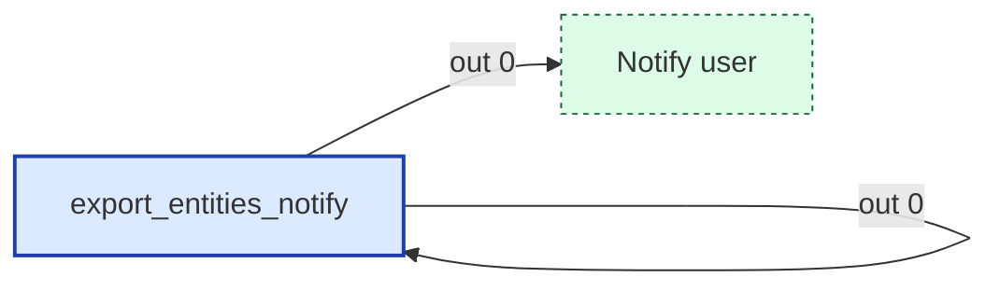

#### Msg contract
Prepares persistent notification for entity list export
Input: msg with msg.exportFilename, msg.entityCount
Output: msg.payload configured for notify_user

#### Upstream
- Write file (file) — this tab

#### Downstream
- **Output 0:**
  - Notify user (link out) — this tab

---

### export_entities_prepare
- **File:** [`export_entities_prepare.js`](../tabs/templates/export_entities_prepare.js)
- **Node ID:** `export_entities_func_prepare_001`
- **Outputs:** 1

#### Neighborhood
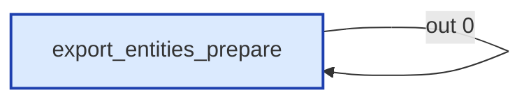

#### Msg contract
Sets up HA Template API call to render the full LibreCoach entity list with area info
Input: msg (triggered by export button)
Output: msg configured for POST /api/template

#### Upstream
- Export Entities Trigger (mqtt in) — this tab

#### Downstream
- **Output 0:**
  - POST /api/template (http request) — this tab

---

### export_entities_publish
- **File:** [`export_entities_publish.js`](../tabs/templates/export_entities_publish.js)
- **Node ID:** `export_entities_func_publish_001`
- **Outputs:** 1

#### Neighborhood
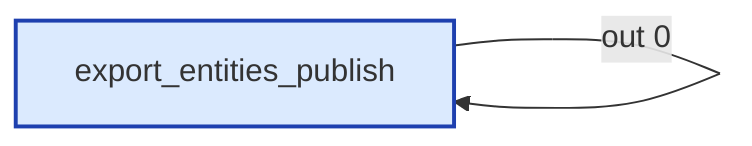

#### Msg contract
Writes AI dashboard prompt and HTML download page to /homeassistant/www/
Input: msg.payload = rendered string from POST /api/template
Output: two messages to File Write node (text file + HTML download page)

#### Upstream
- POST /api/template (http request) — this tab

#### Downstream
- **Output 0:**
  - Write file (file) — this tab

---

### export_ha_config
- **File:** [`export_ha_config.js`](../tabs/templates/export_ha_config.js)
- **Node ID:** `export_func_build_001`
- **Outputs:** 1

#### Neighborhood
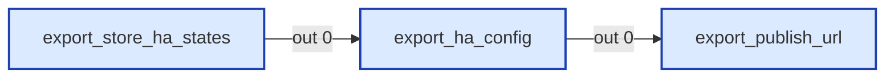

#### Msg contract
Builds export configuration from Home Assistant states
Input:
  msg.states - Array from /api/states
  msg.rvInfo - Object with RV metadata (manufacturer, model, year, other)
Output: msg.exportConfig (object), msg.exportFilename (string)

#### Upstream
- export_store_ha_states (function) — this tab, file: [`export_store_ha_states.js`](../tabs/templates/export_store_ha_states.js)

#### Downstream
- **Output 0:**
  - export_publish_url (function) — this tab, file: [`export_publish_url.js`](../tabs/templates/export_publish_url.js)

---

### export_notify_url
- **File:** [`export_notify_url.js`](../tabs/templates/export_notify_url.js)
- **Node ID:** `c53cf5f35f59ccd6`
- **Outputs:** 1

#### Neighborhood
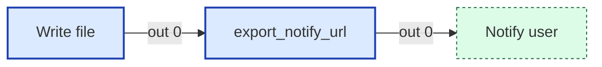

#### Msg contract
Stores filename and prepares notification payload
Input: msg from Notify Export Complete (has msg.entityCount, msg.exportFilename)
Output: msg.payload configured for notify_user

#### Upstream
- Write file (file) — this tab

#### Downstream
- **Output 0:**
  - Notify user (link out) — this tab

---

### export_publish_url
- **File:** [`export_publish_url.js`](../tabs/templates/export_publish_url.js)
- **Node ID:** `export_func_publish_url_001`
- **Outputs:** 1

#### Neighborhood
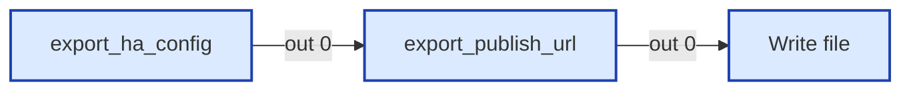

#### Msg contract
Writes export config and download page to /homeassistant/www/
Input: msg.exportConfig (object from Build Export Config)
       msg.exportFilename (dynamic filename from export_ha_config)
Output: two messages to File Write node (JSON export + HTML download page)

#### Upstream
- export_ha_config (function) — this tab, file: [`export_ha_config.js`](../tabs/templates/export_ha_config.js)

#### Downstream
- **Output 0:**
  - Write file (file) — this tab

---

### export_read_rv_info
- **File:** [`export_read_rv_info.js`](../tabs/templates/export_read_rv_info.js)
- **Node ID:** `export_func_read_rv_001`
- **Outputs:** 1

#### Neighborhood
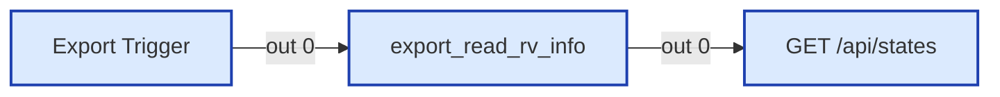

#### Msg contract
Reads RV info and sets up HA API request configuration
Input: msg (triggered by export button)
Output: msg with rvInfo, headers, and url for first API call

#### Upstream
- Export Trigger (mqtt in) — this tab

#### Downstream
- **Output 0:**
  - GET /api/states (http request) — this tab

---

### export_store_ha_states
- **File:** [`export_store_ha_states.js`](../tabs/templates/export_store_ha_states.js)
- **Node ID:** `export_func_store_states_001`
- **Outputs:** 1

#### Neighborhood
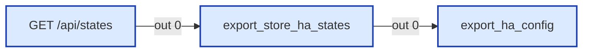

#### Msg contract
Stores Home Assistant states response
Input: msg.payload = response from GET /api/states (array of state objects)
Output: msg with states array ready for export function

#### Upstream
- GET /api/states (http request) — this tab

#### Downstream
- **Output 0:**
  - export_ha_config (function) — this tab, file: [`export_ha_config.js`](../tabs/templates/export_ha_config.js)

---

### import_build_plan
- **File:** [`import_build_plan.js`](../tabs/templates/import_build_plan.js)
- **Node ID:** `a439179f7b78685a`
- **Outputs:** 2

#### Neighborhood
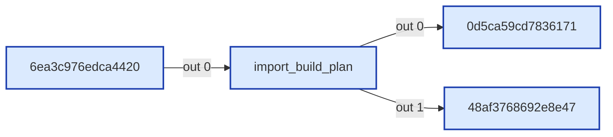

#### Msg contract
Cross-references import entities with current HA entities
Input:
  msg.payload = array of state objects from GET /api/states
  msg.importConfig = { customized, skippedUnchanged, totalInFile }
Output 1: msg.payload = array of { entity_id, friendly_name } for Split pipeline
Output 2: msg.payload = early HTTP response when no entities to update

#### Upstream
- 6ea3c976edca4420 (http request) — this tab

#### Downstream
- **Output 0:**
  - 0d5ca59cd7836171 (split) — this tab
- **Output 1:**
  - 48af3768692e8e47 (http response) — this tab

---

### import_create_page
- **File:** [`import_create_page.js`](../tabs/templates/import_create_page.js)
- **Node ID:** `0bd062c51b9e4b8b`
- **Outputs:** 1

#### Neighborhood
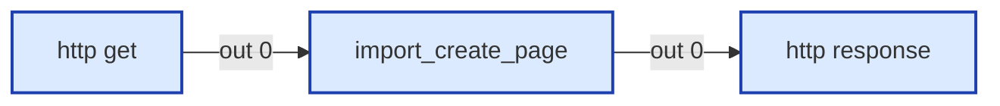

#### Msg contract
Serves the LibreCoach configuration import upload page
Input: HTTP In GET /librecoach/import
Output: msg.payload = HTML string for HTTP Response

#### Upstream
- http get (http in) — this tab

#### Downstream
- **Output 0:**
  - http response (http response) — this tab

---

### import_notify_url
- **File:** [`import_notify_url.js`](../tabs/templates/import_notify_url.js)
- **Node ID:** `55dd74b672a2f509`
- **Outputs:** 1

#### Neighborhood
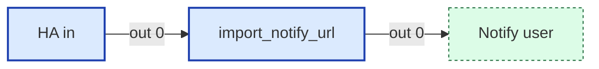

#### Msg contract
Prepares notification payload for Import
Input: MQTT trigger from librecoach/import/trigger
Output: msg.payload configured for notify_user

#### Upstream
- HA in (mqtt in) — this tab

#### Downstream
- **Output 0:**
  - Notify user (link out) — this tab

---

### import_registry_update
- **File:** [`import_registry_update.js`](../tabs/templates/import_registry_update.js)
- **Node ID:** `c2e0c58f22ff4794`
- **Outputs:** 1

#### Neighborhood
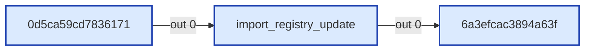

#### Msg contract
Prepares HA entity registry update for a single entity (runs after Split)
Input: msg.payload = { entity_id, friendly_name }
Output: msg configured for ha-api node (WebSocket protocol)

#### Upstream
- 0d5ca59cd7836171 (split) — this tab

#### Downstream
- **Output 0:**
  - 6a3efcac3894a63f (ha-api) — this tab

---

### import_summary
- **File:** [`import_summary.js`](../tabs/templates/import_summary.js)
- **Node ID:** `080d3da2e1d0d2ff`
- **Outputs:** 2

#### Neighborhood
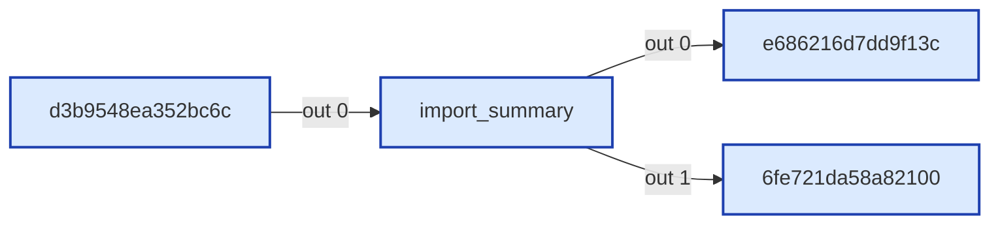

#### Msg contract
Summarizes import results after all entity registry updates complete
Input: msg.payload = array of ha-api WebSocket responses (from Join after Split)
       msg.importCounts = { totalInFile, skippedUnchanged, skippedMissing, toUpdate }
Output 1: msg configured for HA persistent notification
Output 2: JSON result for HTTP Response to browser

#### Upstream
- d3b9548ea352bc6c (join) — this tab

#### Downstream
- **Output 0:**
  - e686216d7dd9f13c (http request) — this tab
- **Output 1:**
  - 6fe721da58a82100 (http response) — this tab

---

### import_validation
- **File:** [`import_validation.js`](../tabs/templates/import_validation.js)
- **Node ID:** `83e45c7061bd9e49`
- **Outputs:** 2

#### Neighborhood
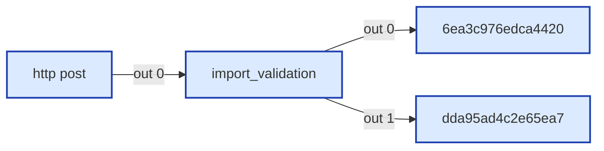

#### Msg contract
Validates incoming import JSON and prepares HA states request
Input: msg.payload = parsed JSON body from POST /librecoach/import
Output 1: valid → msg configured for GET /api/states (with msg.importConfig)
Output 2: error → msg.payload = error JSON for HTTP Response

#### Upstream
- http post (http in) — this tab

#### Downstream
- **Output 0:**
  - 6ea3c976edca4420 (http request) — this tab
- **Output 1:**
  - dda95ad4c2e65ea7 (http response) — this tab

---

### store_rv_info
- **File:** [`store_rv_info.js`](../tabs/templates/store_rv_info.js)
- **Node ID:** `export_func_store_rv_001`
- **Outputs:** 1

#### Neighborhood

#### Msg contract
Stores RV info values from text input entities to flow context
Input: msg.topic = "librecoach/rv_info/{field}/set"
       msg.payload = value string
Output: Republishes to state topic for HA sync

#### Upstream
- RV Info Input (mqtt in) — this tab

#### Downstream
- **Output 0:**
  - MQTT out: Retain TRUE (link out) — this tab

---

## UI Template Nodes

_None._

## Subflow Instances

_None._

## Link Nodes

### Outbound (link out)
- **MQTT out: Retain TRUE** (`12a57f6a07d0bf1a`) →
  - MQTT out: Retain TRUE in tab `Config` ([wiring](./config.md))
- **Notify user** (`47ac3adc971d73eb`) →
  - Notify user in tab `Config` ([wiring](./config.md))
- **Notify user** (`47f3c921ae62126a`) →
  - Notify user in tab `Config` ([wiring](./config.md))
- **Notify user** (`fa104ff19bbee333`) →
  - Notify user in tab `Config` ([wiring](./config.md))

### Inbound (link in)
_None._

## Catch / Status Nodes

_None._

## Other Nodes

- 0d5ca59cd7836171 (split) — id `0d5ca59cd7836171`, in: 1, out: 1
- 48af3768692e8e47 (http response) — id `48af3768692e8e47`, in: 1, out: 0
- 614d0e17e66848f3 (note) — id `614d0e17e66848f3`, in: 0, out: 0
- 6a3efcac3894a63f (ha-api) — id `6a3efcac3894a63f`, in: 1, out: 1
- 6ea3c976edca4420 (http request) — id `6ea3c976edca4420`, in: 1, out: 1
- 6fe721da58a82100 (http response) — id `6fe721da58a82100`, in: 1, out: 0
- Export AI Dashboard Prompt (group) — id `export_entities_group_001`, in: 0, out: 0
- Export Configuration (group) — id `export_config_group_001`, in: 0, out: 0
- Export Entities Trigger (mqtt in) — id `export_entities_mqtt_in_001`, in: 0, out: 1
- Export Trigger (mqtt in) — id `export_mqtt_in_trigger_001`, in: 0, out: 1
- GET /api/states (http request) — id `export_http_states_001`, in: 1, out: 1
- HA in (mqtt in) — id `ac639050da7648b9`, in: 0, out: 1
- Import Configuration (group) — id `3296e5f0fcd2c737`, in: 0, out: 0
- POST /api/template (http request) — id `export_entities_http_001`, in: 1, out: 1
- RV Info Input (mqtt in) — id `export_mqtt_in_rv_info_001`, in: 0, out: 1
- Write file (file) — id `de184f27cbcc117f`, in: 1, out: 1
- Write file (file) — id `export_entities_file_001`, in: 1, out: 1
- d3b9548ea352bc6c (join) — id `d3b9548ea352bc6c`, in: 1, out: 1
- dda95ad4c2e65ea7 (http response) — id `dda95ad4c2e65ea7`, in: 1, out: 0
- e686216d7dd9f13c (http request) — id `e686216d7dd9f13c`, in: 1, out: 0
- http get (http in) — id `50bc401ae974546e`, in: 0, out: 1
- http post (http in) — id `616a7d5b8036c0b5`, in: 0, out: 1
- http response (http response) — id `40e089e9bdbb5373`, in: 1, out: 0
